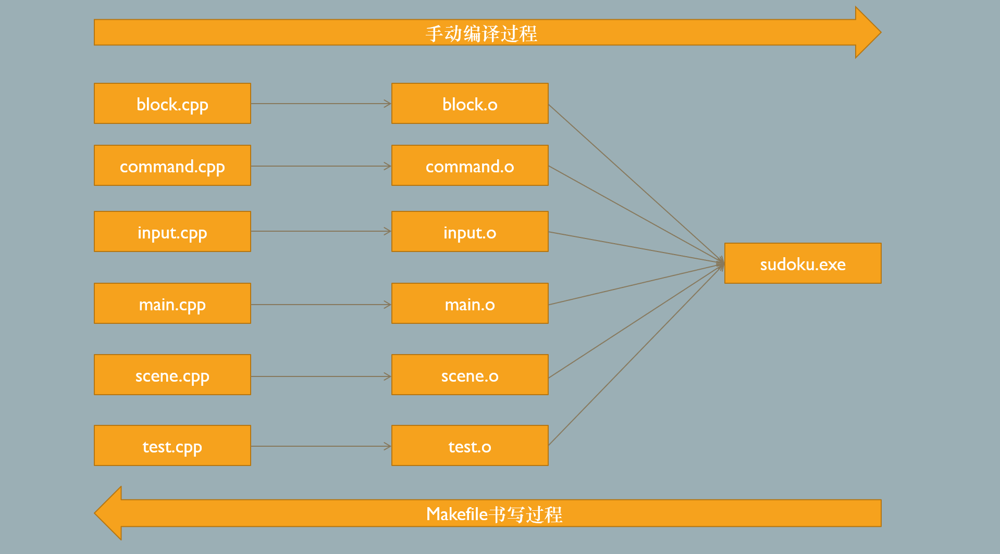

# 学习环境搭建

### Linux（以Ubuntu为例）

```shell
sudo apt install gcc g++ make
```

### Windows

学习与演示过程以Windows为主，Windows上装MinGW环境，MinGW官网： https://www.mingw-w64.org/
之前我们提过两个版本的环境，**MingW-W64-builds**和**w64devkit**
推荐使用**w64devkit**套件，里面工具比较齐全，还提供模拟了许多Linux命令，用这个套件环境来学习可以保持在Linux与Windows上Makefile书写方式一致。
以下是w64devkit与其他包一些命令的区别

| w64devkit（模拟Linux） | MingW-W64-builds或其他套件（Windows cmd命令） |
|:------------------:|:------------------------------------:|
| make               | mingw32-make                         |
| cc                 | gcc                                  |
| rm                 | del                                  |
| touch              |                                      |
| ls                 | dir                                  |
| sh                 |                                      |
| mv                 |                                      |
| cp                 | copy/xcopy                           |
| sed                |                                      |

&nbsp;

### 学习材料

make官方文档： https://www.gnu.org/software/make/manual/make.html

2048: https://github.com/plibither8/2048.cpp

sudoku:  https://github.com/mayerui/sudoku
&nbsp;
&nbsp;
&nbsp;
&nbsp;

# Makefile基础知识

## make使用流程

1. 准备好需要编译的源代码
2. 编写Makefile文件
3. 在命令行执行make命令

&nbsp;
&nbsp;

## 最简单的Makefile

```makefile
hello: hello.cpp
    g++ hello.cpp -o hello # 开头必须为一个Tab，不能为空格
```

**但通常需要将编译与链接分开写，分为如下两步**

```makefile
hello: hello.o
    g++ hello.o -o hello
hello.o: hello.cpp
    g++ -c hello.cpp
```

&nbsp;

**规则**(Rules)：一个Makefile文件由一条一条的规则构成，一条规则结构如下

```makefile
target … (目标): prerequisites …(依赖)
        recipe(方法)
        …
        …
```

第二种写法

```makefile
target … (目标): prerequisites …(依赖); recipe(方法) ;…
```

&nbsp;
&nbsp;
Make主要用于处理C和C++的编译工作，但不只能处理C和C++，所有编译器/解释器能在命令行终端运行的编程语言都可以处理(例如Java、Python、 Golang....)。Make也不只能用来处理编程语言，所有基于一些文件(依赖)的改变去更新另一些文件(目标)的工作都可以做。

**Make编译与打包Java程序示例**

```makefile
snake.jar : C.class Main.class SnakeFrame.class SnakePanel.class
    jar -cvfe snake.jar Main *.class

C.class : C.java
    javac C.java

Main.class : Main.java
    javac Main.java

SnakeFrame.class : SnakeFrame.java
    javac SnakeFrame.java

SnakePanel.class : SnakePanel.java
    javac SnakePanel.java

.PHONY: clean
clean:
    rm *.class *.jar
```

&nbsp;
&nbsp;
&nbsp;
&nbsp;
&nbsp;

## Makefile文件的命名与指定

Make会自动查找makefile文件，查找顺序为GNUmakefile -> makefile -> Makefile

**GNUmakefile**：不建议使用，因为只有GNU make会识别，其他版本的make（如BSD make, Windows nmake等）不会识别，如果只给GNU make使用的情况

**makefile**：可以使用，GNU make和其他版本make识别

**Makefile**：最常用，强烈建议使用

如果运行make的时候没有找到以上名字的文件，则会报错，这时候可以手动指定文件名

```shell
make -f mkfile  # make -f <filename>
make --file=mkfile # make --file=<filename>
```

> 手动指定之后，make就会使用指定的文件，即使有Makefile或者makefile不会再自动使用

&nbsp;
&nbsp;
&nbsp;

## Makefile文件内容组成

一个Makefile文件通常由五种类型的内容组成：显式规则、隐式规则、变量定义、指令和注释

**显式规则**(*explicit rules*)：显式指明何时以及如何生成或更新目标文件，显式规则包括目标、依赖和更新方法三个部分

**隐式规则**(*implicit rules*)：根据文件自动推导如何从依赖生成或更新目标文件。

**变量定义**(*variable definitions*)：定议变量并指定值，值都是字符串，类似C语言中的宏定义(#define)，在使用时将值展开到引用位置

**指令**(*directives*)：在make读取Makefile的过程中做一些特别的操作，包括：

1. 读取(包含)另一个makefile文件(类似C语言中的#include)

2. 确定是否使用或略过makefile文件中的一部分内容(类似C语言中的#if)

3. 定义多行变量

**注释**(*comments*)：一行当中 # 后面的内容都是注释，不会被make执行。make当中只有单行注释。如果需要用到#而不是注释，用\\\#。

&nbsp;
&nbsp;
&nbsp;
&nbsp;

&nbsp;

&nbsp;

## 一个稍微复杂的Makefile



```makefile
sudoku: block.o command.o input.o main.o scene.o test.o
    g++ -o sudoku block.o command.o input.o main.o scene.o test.o

block.o: block.cpp common.h block.h color.h
    g++ -c block.cpp

command.o: command.cpp scene.h common.h block.h command.h
    g++ -c command.cpp

input.o: input.cpp common.h utility.inl
    g++ -c input.cpp

main.o: main.cpp scene.h common.h block.h command.h input.h
    g++ -c main.cpp

scene.o: scene.cpp common.h scene.h block.h command.h utility.inl
    g++ -c scene.cpp

test.o: test.cpp test.h scene.h common.h block.h command.h
    g++ -c test.cpp

hello.o: hello.cpp
    g++ -c hello.cpp


clean:
    rm block.o command.o input.o main.o scene.o test.o
    rm sudoku.exe
```

```makefile
target … (目标): prerequisites …(依赖)
        recipe(方法)
        …
        …
```

## 目标

1. Makefile中会有很多目标，但最终目标只有一个，其他所有内容都是为这个最终目标服务的，写Makefile的时候**先写出最终目标，再依次解决总目标的依赖**

2. 一般情况第一条规则中的目标会被确立为最终目标，第一条规则默认会被make执行

3. 通常来说目标是一个文件，一条规则的目的就是生成或更新目标文件。

4. make会根据目标文件和依赖文件最后修改时间判断是否需要执行更新目标文件的方法。如果目标文件不存在或者目标文件最后修改时间早于其中一个依赖文件最后修改时间，则重新执行更新目标文件的方法。否则不会执行。

5. 除了最终目标对应的更新方法默认会执行外，如果Makefile中一个目标不是其他目标的依赖，那么这个目标对应的规则不会自动执行。需要手动指定，方法为
   
   ```makefile
   make <target>  # 如 make clean , make hello.o
   ```

6. 可以使用.DEFAULT_GOAL来修改默认最终目标
   
   ```makefile
   .DEFAULT_GOAL = main
   
   all: 
       @echo all
   
   main:
       @echo main
   ```

&nbsp;

&nbsp;

&nbsp;

&nbsp;

## 伪目标

如果一个标并不是一个文件，则这个目标就是伪目标。例如前面的clean目标。如果说在当前目录下有一个文件名称和这个目标名称冲突了，则这个目标就没法执行。这时候需要用到一个特殊的目标 .PHONY，将上面的clean目标改写如下 

```makefile
.PHONY: clean
clean:
    rm block.o command.o input.o main.o scene.o test.o
    rm sudoku.exe
```

这样即使当前目录下存在与目标同名的文件，该目标也能正常执行。

**伪目标的其他应用方式**

如果一条规则的依赖文件没有改动，则不会执行对应的更新方法。如果需要每次不论有没有改动都执行某一目标的更新方法，可以把对应的目标添加到.PHONY的依赖中，例如下面这种方式，则每次执行make都会更新test.o，不管其依赖文件有没有改动

```makefile
test.o: test.cpp test.h
        g++ -c test.cpp

.PHONY: clean test.o
```

&nbsp;

&nbsp;

&nbsp;

&nbsp;

&nbsp;

&nbsp;

## 依赖

### 依赖类型

**普通依赖**

前面说过的这种形式都是普通依赖。直接列在目标后面。普通依赖有两个特点：

1. 如果这一依赖是由其他规则生成的文件，那么执行到这一目标前会先执行生成依赖的那一规则 
2. 如果任何一个依赖文件修改时间比目标晚，那么就重新生成目标文件

**order-only依赖**

依赖文件不存在时，会执行对应的方法生成，但依赖文件更新并不会导致目标文件的更新

如果目标文件已存在，order-only依赖中的文件即使修改时间比目标文件晚，目标文件也不会更新。

定义方法如下：

```makefile
targets : normal-prerequisites | order-only-prerequisites
```

normal-prerequisites部分可以为空

&nbsp;

&nbsp;

&nbsp;

&nbsp;

&nbsp;

### 指定依赖搜索路径

make默认在Makefile文件所在的目录下查找依赖文件，如果找不到，就会报错。这时候就需要手动指定搜索路径，用VPATH变量或vpath指令。

**VPATH用法如下：**

```makefile
VPATH = <dir1>:<dir2>:<dir3>...
# 例如
VPATH = include:src
```

多个目录之间冒号隔开，这时make会在VPATH指定的这些目录里面查找依赖文件。

**vpath指令用法：**

vpath比VPATH使用更灵活，可以指定某个类型的文件在哪个目录搜索。

用法如下：

```makefile
vpath <pattern> <directories>

vpath %.h include  # .h文件在include目录下查找
vpath %.h include:headers  # .h文件在include或headers文件下查找

vpath % src   # 所有文件都在src下查找

vpath hello.cpp src  # hello.cpp文件在src查找
```

&nbsp;

&nbsp;

&nbsp;

&nbsp;

## 更新方法

```makefile
target … (目标): prerequisites …(依赖)
        recipe(方法)
        …
        …
```

#### 关于执行终端

更新方法实际上是一些Shell指令，通常以Tab开头，或直接放在目标-依赖列表后面，用分号隔开。这些指令都需要交给Shell执行，所以需要符合Shell语法。默认使用的Shell是sh，在Windows上如果没有安装sh.exe的话会自动查找使用cmd.exe之类的终端。这时有的指令写法，例如循环语句，与Linux不同，需要注意。

可以通过SHELL变量手动指定Shell

```makefile
SHELL = C:/Windows/System32/WindowsPowerShell/v1.0/powershell.exe
SHELL = cmd.exe
```

默认的执行方式为一条指令重新调用一个Shell进程来执行。有时为了提高性能或其他原因，想让这个目标的所有指令都在同一进程中执行，可以在Makefile中添加 .ONESHELL

```makefile
 .ONESHELL:
```

这样所有指令都会在同一次Shell调用中执行

#### Shell语句回显问题

通常make在执行一条Shell语句前都会先打印这条语句，如果不想打印可以在语句开头在@

```makefile
@echo hello
@g++ -o hello hello.cpp
```

也可以使用.SILENT来指定哪些目标的更新方法指令不用打印

```makefile
.SILENT: main all
```

#### 错误处理

如果一条规则当中包含多条Shell指令，每条指令执行完之后make都会检查返回状态，如果返回状态是0，则执行成功，继续执行下一条指令，直到最后一条指令执行完成之后，一条规则也就结束了。

如果过程中发生了错误，即某一条指令的返回值不是0，那么make就会终止执行当前规则中剩下的Shell指令。

例如

```makefile
clean:
    rm main.o hello.o
    rm main.exe
```

这时如果第一条rm main.o hello.o出错，第二条rm main.exe就不会执行。类似情况下，希望make忽视错误继续下一条指令。在指令开头`-`可以达到这种效果。

```makefile
clean:
    -rm main.o hello.o
    -rm main.exe
```

&nbsp;

&nbsp;

&nbsp;

&nbsp;

&nbsp;

&nbsp;

## 变量应用

Makefile中的变量有点类似C语言中的宏定义，即用一个名称表示一串文本。但与C语言宏定义不同的是，Makefile的变量值是可以改变的。变量定义之后可以在目标、依赖、方法等Makefile文件的任意地方进行引用。

> Makefile中的变量值只有一种类型： 字符串

**变量可以用来表示什么**

- 文件名序列

- 编译选项

- 需要运行的程序

- 需要进行操作的路径

- ......

### 变量定义与引用方式

**定义方式**

```makefile
# <变量名> = <变量值>  <变量名> := <变量值>  <变量名> ::= <变量值>
files = main.cpp hello.cpp
objects := main.o hello.o
var3 ::= main.o
```

> 变量名区分大小写，可以是任意字符串，不能含有":", "#", "="

**使用方式**

```makefile
# $(<变量名>) 或者 ${<变量名>}
main.o : $(files) # 或者 ${files}
    ...
```

> 如果变量名只有一个字符，使用时可以不用括号，如\$a, \$b， 但不建议这样用，不管是否只有一个字符都写成\$(a), \$(b)这种形式

### Makefile读取过程

GNU make分两个阶段来执行Makefile，第一阶段(读取阶段)：

- 读取Makefile文件的所有内容

- 根据Makefile的内容在程序内建立起变量

- 在程序内构建起显式规则、隐式规则

- 建立目标和依赖之间的依赖图

第二阶段(目标更新阶段)：

- 用第一阶段构建起来的数据确定哪个目标需要更新然后执行对应的更新方法

变量和函数的展开如果发生在第一阶段，就称作**立即展开**，否则称为**延迟展开**。立即展开的变量或函数在第一个阶段，也就是Makefile被读取解析的时候就进行展开。延迟展开的变量或函数将会到用到的时候才会进行展开，有以下两种情况：

+ 在一个立即展开的表达式中用到

+ 在第二个阶段中用到

**显式规则中，目标和依赖部分都是立即展开，在更新方法中延迟展开**

&nbsp;

&nbsp;

&nbsp;

&nbsp;

&nbsp;

&nbsp;

### 变量赋值

#### 递归展开赋值（延迟展开）

第一种方式就是直接使用<kbd>=</kbd>，这种方式如果赋值的时候右边是其他变量引用或者函数调用之类的，将不会做处理，直接保留原样，在使用到该变量的时候再来进行处理得到变量值（Makefile执行的第二个阶段再进行变量展开得到变量值）

```makefile
bar2 = ThisIsBar2No.1
foo = $(bar)
foo2 = $(bar2)

all:
    @echo $(foo)  # Huh?
    @echo $(foo2)  # ThisIsBar2No.2
    @echo $(ugh)   # Huh?

bar = $(ugh)
ugh = Huh?
bar2 = ThisIsBar2No.2
```

#### 简单赋值(立即展开)

简单赋值使用<kbd>\:=</kbd>或<kbd>::=</kbd>，这种方式如果等号右边是其他变量或者引用的话，将会在赋值的时候就进行处理得到变量值。（Makefile执行第一阶段进行变量展开）

```makefile
bar2 := ThisIsBar2No.1
foo := $(bar)
foo2 := $(bar2)

all:
    @echo $(foo)    # 空串，没有内容
    @echo $(foo2)    # ThisIsBar2No.1
    @echo $(ugh)    # 

bar := $(ugh)
ugh := Huh?
bar2 := ThisIsBar2No.2
```

#### 条件赋值

条件赋值使用<kbd>?=</kbd>，如果变量已经定义过了（即已经有值了），那么就保持原来的值，如果变量还没赋值过，就把右边的值赋给变量。

```makefile
var1 = 100
var1 ?= 200

all:
    @echo $(var1) # 100 注释var1 = 100之后为200
```

**练习**：试求a的值

```makefile
x = hello
y = world
a := $(x)$(y)

x = y
y = z
a := $($(x))

x = y
y = z
z = u
a := $($($(x)))

x = $(y)
y = z
z = Hello
a := $($(x))
```

#### 追加

使用<kbd>+=</kbd>在变量已有的基础上追加内容

```makefile
files = main.cpp
files += hello.cpp

all:
    @echo $(files)
```

#### Shell运行赋值

使用<kbd>!=</kbd>，运行一个Shell指令后将返回值赋给一个变量

```makefile
gcc_version != gcc --version
files != ls .
```

> 如果使用Windows需要注意，这种赋值方式只适用于与Linux相同的Shell指令，Windows独有的指令不能这样使用。

&nbsp;

&nbsp;

&nbsp;

&nbsp;

### 定义多行变量

前面定义的变量都是单行的。

变量值有多行，多用于定义shell指令

**语法**

```makefile
define <varable_name>  # 默认为 = 
# 变量内容
endef

define <varable_name> :=
# 变量内容
endef

define <varable_name> +=
# 变量内容
endef
```

&nbsp;

**示例**

```makefile
echosomething = @echo This is the first line

define echosomething +=  

@echo hello
@echo world
@echo 3
endef


all:
    $(echosomething)
```

### 取消变量

如果想清除一个变量，用以下方法

```makefile
undefine <变量名>   如 undefine files,  undefine objs
```

### 环境变量的使用

系统中的环境变量可以直接在Makefile中直接使用，使用方法跟普通变量一样

```makefile
all:
    @echo $(USERNAME)
    @echo $(JAVA_HOME)
    @echo $(SystemRoot)
```

### 变量替换引用

语法：__\$(var:a=b)__，意思是将变量var的值当中每一项结尾的a替换为b，直接上例子

```makefile
files = main.cpp hello.cpp
objs := $(files:.cpp=.o) # main.o hello.o
# 另一种写法
objs := $(files:%.cpp=%.o)
```

### 变量覆盖

所有在Makefile中的变量，都可以在执行make时能过指定参数的方式进行覆盖。

```makefile
OverridDemo := ThisIsInMakefile
all:
    @echo $(OverridDemo)
```

如果直接执行

```shell
make
```

则上面的输出内容为*ThisIsInMakefile*，但可以在执行make时指定参数：

```shell
make OverridDemo=ThisIsFromOutShell # 等号两边不能有空格
# 如果变量值中有空格，需要用引号
make OverridDemo=“This Is From Out Shell”
```

则输出OverridDemo的值是ThisIsFromOutShell或This Is From Out Shell。

用这样的命令参数会覆盖Makefile中对应变量的值，如果不想被覆盖，可以在变量前加上override指令，override具有较高优先级，不会被命令参数覆盖

```makefile
override OverridDemo := ThisIsInMakefile
all:
    @echo $(OverridDemo)
```

这样即使命令行指定参数

```shell
make OverridDemo=ThisIsFromOutShell
```

输出结果依然是ThisIsInMakefile

&nbsp;

&nbsp;

&nbsp;

&nbsp;

&nbsp;

### 自动变量

**\$@**：①本条规则的目标名；②如果目标是归档文件的成员，则为归档文件名；③在多目标的模式规则中, 为导致本条规则方法执行的那个目标名；

**\$<**：本条规则的第一个依赖名称

**\$?**：依赖中修改时间晚于目标文件修改时间的所有文件名，以空格隔开

**\$^**：所有依赖文件名，文件名不会重复，不包含order-only依赖

**\$+**：类似上一个， 表示所有依赖文件名，包括重复的文件名，不包含order-only依赖

**\$|**：所有order-only依赖文件名

__\$*__：(简单理解)目标文件名的主干部分(即不包括后缀名)

**\$%**：如果目标不是归档文件，则为空；如果目标是归档文件成员，则为对应的成员文件名

&nbsp;

以下变量对应上述变量，D为对应变量所在的目录，结尾不带/，F为对应变量除去目录部分的文件名

__\$(@D)__

__\$(@F)__

__\$(*D)__

__\$(*F)__

__\$(%D)__

__\$(%F)__

__\$(<D)__

__\$(<F)__

__\$(^D)__

__\$(^F)__

__\$(+D)__

__\$(+F)__

__\$(?D)__

__\$(?F)__

&nbsp;

&nbsp;

&nbsp;

&nbsp;

&nbsp;

### 绑定目标的变量

Makefile中的变量一般是全局变量。也就是说定义之后在Makefile的任意位置都可以使用。但也可以将变量指定在某个目标的范围内，这样这个变量就只能在这个目标对应的规则里面保用

语法

```makefile
target … : variable-assignment
target … : prerequisites
    recipes
    …
```

例

```makefile
var1 = Global Var

first: all t2

all: var2 = Target All Var
all:
    @echo $(var1)
    @echo $(var2)

t2:
    @echo $(var1)
    @echo $(var2)
```

这种定义变量的方式，目标也可以使用模式匹配，这样所有能匹配上的目标范围内都可以使用这些变量

```makefile
var1 = Global Var

first: all.v t2.v t3

%.v: var2 = Target %.v Var
all.v:
    @echo $@ -- $(var1)
    @echo $@ -- $(var2)

t2.v:
    @echo $@ -- $(var1)
    @echo $@ -- $(var2)
t3:
    @echo $@ -- $(var1)
    @echo $@ -- $(var2)
```

&nbsp;

&nbsp;

&nbsp;

&nbsp;

&nbsp;

### 二次展开

前面说过依赖中的变量都是在Makefile读取阶段立即展开的。如果想让依赖的的变量延迟展开，可以使用.SECONDEXPANSION:，添加之后，在依赖中使用变量时用`$$`，可以让变量在第二阶段进行二次展开，从而达到延迟展开的效果。

```makefile
VAR1 = main.cpp
.SECONDEXPANSION:
all: $$(VAR1)
    @echo $^

VAR1 = hello.cpp
```

&nbsp;

&nbsp;

&nbsp;

&nbsp;

&nbsp;

&nbsp;

&nbsp;

&nbsp;

&nbsp;

# 自动推导与隐式规则

Makefile中有一些生成目标文件的规则使用频率非常高，比如由.c或.cpp文件编译成.o文件，这样的规则在make中可以自动推导，所以可以不用明确写出来，这样的规则称为隐式规则。

## 一些make预定义的规则

### C语言编译

从.c到.o

```makefile
$(CC) $(CPPFLAGS) $(CFLAGS) -c
```

### C++编译

从.cc .cpp .C到.o

```makefile
$(CXX) $(CPPFLAGS) $(CXXFLAGS) -c
```

### 链接

由.o文件链接到可执行文件

```makefile
$(CC) $(LDFLAGS) *.o $(LOADLIBES) $(LDLIBS)
```

## 隐式规则中常用一些变量

这些变量都有默认值，也可以自行修改

### CC

编译C语言的程序，默认为 `cc`

### CXX

编译C++的程序，默认为 `g++`

### AR

归档程序，默认为 `ar`

### CPP

C语言预处理程序，默认为 `$(CC) -E`

### RM

删除文件的程序，默认为`rm -f`

### CFLAGS

传递给C编译器的一些选项，如-O2 -Iinclude

### CXXFLAGS

传递给C++编译器的一些选项，如-std=c++ 11 -fexec-charset=GBK   

### CPPFLAGS

C语言预处理的一些选项

### LDFLAGS

链接选项，如-L.

### LDLIBS

链接需要用到的库，如-lkernel32 -luser32 -lgdi32

&nbsp;

&nbsp;

&nbsp;

&nbsp;

&nbsp;

&nbsp;

&nbsp;

# 多目标与多规则

显式规则中一条规则可以有多个目标，多个目标可以是相互独立的目标，也可以是组合目标，用写法来区分

## 独立多目标

相互独立的多个目标与依赖之间直接用`:`，常用这种方式的有以下两种情况

1. 只需要写目标和依赖，不需要写方法的时候
   
   ```makefile
   block.o input.o scene.o : common.h
   ```
   
   这种写法等价于
   
   ```makefile
   block.o : common.h
   input.o : common.h
   scene.o : common.h
   ```

2. 生成(更新)目标的方法写法一样的，只是依赖与目标不一样时。之前写的Makfile中，有如下代码：
   
   ```makefile
   block.o: block.cpp common.h block.h color.h
       g++ -c block.cpp
   command.o: command.cpp command.h scene.h
       g++ -c command.cpp
   input.o: input.cpp common.h utility.inl
       g++ -c input.cpp
   main.o: main.cpp scene.h input.h test.h
       g++ -c main.cpp
   scene.o: scene.cpp common.h scene.h utility.inl
       g++ -c scene.cpp
   test.o: test.cpp test.h
       g++ -c test.cpp
   ```
   
   所有.o文件的生成都用的同一方法
   
   ```makefile
   g++ -c <文件名>
   ```
   
   如果不考虑依赖源文件进行更新时，可以进行简写如下：
   
   ```makefile
   block.o command.o input.o main.o scene.o test.o : common.h block.h command.h ...
       g++ -c $(@:%.o=%.cpp)
   ```
   
   这种写法实际上等价于
   
   ```makefile
   block.o : common.h block.h command.h ...
       g++ -c $(subst .o,.cpp,$@)
   command.o : common.h block.h command.h ...
       g++ -c $(subst .o,.cpp,$@)
   input.o : common.h block.h command.h ...
       g++ -c $(subst .o,.cpp,$@)
   main.o : common.h block.h command.h ...
       g++ -c $(subst .o,.cpp,$@)
   scene.o : common.h block.h command.h ...
       g++ -c $(subst .o,.cpp,$@)
   test.o : common.h block.h command.h ...
       g++ -c $(subst .o,.cpp,$@)
   ```
   
   其中，$@表示的是目标名称。subst是一个字符串替换函数，$(subst .o,.cpp,$@)表示将目标名称中的.o替换为.cpp。
   
   这样的简写可以减少内容的书写量，但是不利于将每个目标与依赖分别对应。

独立多目标虽然写在一起，但是每个目标都是单独调用一次方法来更新的。和分开写效果一样。

## 组合多目标

多目标与依赖之前用`&:`，这样的多个目标称为组合目标。与独立多目标的区别在于，独立多目标每个目标的更新需要单独调用一次更新方法。而组合多目标调用一次方法将更新所有目标

```makefile
block.o input.o scene.o &: block.cpp input.cpp scene.cpp common.h
    g++ -c block.cpp
    g++ -c input.cpp
    g++ -c scene.cpp
```

所有目标的更新方法都写到其中，每次更新只会调用一次。

## 同一目标多条规则

同一目标可以对应多条规则。同一目标的所有规则中的依赖会被合并。但如果同一目标对应的多条规则都写了更新方法，则会使用最新的一条更新方法，并且会输出警告信息。

同一目标多规则通常用来给多个目标添加依赖而不用改动已写好的部分。

```makefile
input.o: input.cpp utility.inl
    g++ -c input.cpp
main.o: main.cpp scene.h input.h test.h
    g++ -c main.cpp
scene.o: scene.cpp scene.h utility.inl
    g++ -c scene.cpp

input.o main.o scene.o : common.h
```

同时给三个目标添加了一个依赖common.h，但是不用修改上面已写好的部分。

# 静态模式

独立多目标可以简化Makefile的书写，但是不利于将各个目标的依赖分开，让目标文件根据各自的依赖进行更新。静态模式可以在一定程度上改进依赖分开问题。

静态模式就是用`%`进行文件匹配来推导出对应的依赖。

**语法**

```makefile
targets …: target-pattern(目标模式): prereq-patterns(依赖模式) …
        recipe
        …
```

先看一个例子

```makefile
block.o : %.o : %.cpp %.h
    g++ -c $<
```

block.o为目标，%.o为目标模式，%.cpp，%.h为依赖模式，对于这一条规则，%.o代表的是目标文件block.o，所以这里的%匹配的是block，因此，%.cpp表示block.cpp，%.h代表block.h，所以block.o : %.o : %.cpp %.h表示的意思同下面这种写法

```makefile
block.o : block.cpp block.h
```

自动推导出block.o依赖block.cpp和block.h。

另外，\$<表示目标的第一个依赖，在这条规则中，\$<表示block.cpp

对应的Makefile可以做如下改进

```makefile
block.o command.o input.o scene.o test.o: %.o : %.cpp %.h
    g++ -c $<
main.o: main.cpp scene.h input.h test.h
    g++ -c main.cpp
```

用这种方式可以在简写的同时一定程度上解决各个目标对应的依赖问题。

(不属于静态模式的内容，隐式规则的内容)利用模式匹配可以直接将所有.cpp到.o文件的编译简写为如下

```makefile
%.o : %.cpp %.h
    g++ -c $<
```

# 条件判断

使用条件指令可以让make执行或略过Makefile文件中的一些部分。

**ifdef**  判断一个变量是已否定义

```makefile
OS = Linux
ifdef Win
    OS = Windows
endif


OS = Linux
ifdef Win
    OS = Windows
else ifdef Mac
    OS= MacOS
endif


ifdef Win
    OS = Windows
else ifdef Mac
    OS= MacOS
else 
    OS = Linux
endif
```

**ifndef** 判断一个变量是否没被定义

```makefile
ifndef FLAGS
    FLAGS = -finput-charset=utf-8
endif
```

**ifeq** 判断两个值是否相等

```makefile
version = 3.0

ifeq ($(version),1.0)            # ifeq后一定要一个空格
    msg := 版本太旧了，请更新版本
else ifeq ($(version), 3.0)
    msg := 版本太新了，也不行
else
    msg := 版本可以用
endif


# 另外的写法
msg = Other
ifeq "$(OS)" "Windows_NT"
    msg = This is a Windows Platform
endif

ifeq '$(OS)' 'Windows_NT'

ifeq '$(OS)' "Windows_NT"
```

**ifneq** 判断两个值是否不等

用法及参数同ifeq，只是判断结果相反

&nbsp;

&nbsp;

&nbsp;

&nbsp;

&nbsp;

# 文本处理函数

C语言中，函数调用方法是function(arguments)；但在Makefile中调用函数的写法不同

```makefile
$(function arguments) 或 ${function arguments}
$(function arg1,$(arg2),arg3 ...)  # 参数之间不要有空格
```

## 字符替换与分析

#### **subst**

文本替换函数，返回替换后的文本

```makefile
$(subst target,replacement,text)
        --- 用relacement替换text中的target
        --- target 需要替换的内容
        --- replacement 替换为的内容
        --- text 需要处理的内容，可以是任意字符串


objs = main.o hello.o
srcs = $(subst .o,.cpp,$(objs))
headers = $(subst .cpp,.h,$(srcs))

all:
    @echo $(srcs)
    @echo $(headers)
```

**patsubst**

模式替换， 返回替换后的文本

```makefile
$(patsubst pattern,replacement,text)
        --- pattern 需要替换的模式
        --- replacement 需要替换为
        --- text 待处理内容，各项内容需要用空格隔开


objs = main.ohello.o
srcs = $(subst %.o,%.cpp,$(objs))
headers = $(subst %.cpp,%.h,$(srcs))    
```

#### **strip**

去除字符串头部和尾部的空格，中间如果连续有多个空格，则用一个空格替换，返回去除空格后的文本

```makefile
$(strip string)
        --- string 需要去除空格的字符串


files = aa hello.cpp      main.cpp     test.cpp
files := $(subst aa,        ,$(files))
files2 = $(strip $(files))
```

#### findstring

查找字符串，如果找到了，则返回对应的字符串，如果没找到，则反回空串

```makefile
$(findstring find,string)
        --- find 需要查找的字符串
        --- string 用来查找的内容

files = hello.cpp main.cpp test.cpp
find = $(findstring hel,$(files))
find = $(findstring HEL,$(files))
```

#### filter

从文本中筛选出符合模式的内容并返回

```makefile
$(filter pattern…,text)
        --- pattern 模式，可以有多个，用空格隔开
        --- text 用来筛选的文本，多项内容需要用空格隔开，否则只会当一项来处理

files = hello.cpp main.cpp test.cpp main.o hello.o hello.h
files2 = $(filter %.o %.h,$(files))
```

#### filter-out

与filter相反，过滤掉符合模式的，返回剩下的内容

```makefile
$(filter-out pattern…,text)
        --- pattern 模式，可以有多个，用空格隔开
        --- text 用来筛选的文本，多项内容需要用空格隔开，否则只会当一项来处理


files = hello.cpp main.cpp test.cpp main.o hello.o hello.h
files2 = $(filter-out %.o %.cpp,$(files))
```

#### sort

将文本内的各项按字典顺序排列，并且移除重复项

```makefile
$(sort list)
        --- list 需要排序内容


files = hello.cpp main.cpp test.cpp main.o hello.o hello.h main.cpp hello.cpp
files2 = $(sort $(files))
```

#### word

用于返回文本中第n个单词

```makefile
$(word n,text)
        --- n 第n个单词，从1开始，如果n大于总单词数，则返回空串
        --- text 待处理文本

files = hello.cpp main.cpp test.cpp main.o hello.o hello.h main.cpp hello.cpp
files2 = $(word 3,$(files))
```

#### wordlist

用于返回文本指定范围内的单词列表

```makefile
$(wordlist start,end,text)
        --- start 起始位置，如果大于单词总数，则返回空串
        --- end 结束位置，如果大于单词总数，则返回起始位置之后全部，如果start > end，什么都不返回

files = hello.cpp main.cpp test.cpp main.o hello.o hello.h main.cpp hello.cpp
files2 = $(wordlist 3,6,$(files))
```

#### words

返回文本中单词数

```makefile
$(words text)
        --- text 需要处理的文本


files = hello.cpp main.cpp test.cpp main.o hello.o hello.h main.cpp hello.cpp
nums = $(words $(files))
```

#### firstword

返回第一个单词

```makefile
$(firstword text)
```

#### lastword

返回最后一个单词

```makefile
$(lastword text)
```

## 文件名处理函数

#### dir

返回文件目录

```makefile
$(dir files)
        --- files 需要返回目录的文件名，可以有多个，用空格隔开

files = src/hello.cpp main.cpp

files2 = $(dir $(files))
```

#### notdir

返回除目录部分的文件名

```makefile
$(notdir files)
        --- files 需要返回文件列表，可以有多个，用空格隔开

files = src/hello.cpp main.cpp
files2 = $(notdir $(files))
```

#### suffix

返回文件后缀名，如果没有后缀返回空

```makefile
$(suffix files)
        --- files 需要返回后缀的文件名，可以有多个，用空格隔开


files = src/hello.cpp main.cpp hello.o hello.hpp hello
files2 = $(suffix $(files))
```

#### basename

返回文件名除后缀的部分

```makefile
$(basename files)
        --- files 需要返回的文件名，可以有多个，用空格隔开


files = src/hello.cpp main.cpp hello.o hello.hpp hello
files2 = $(basename $(files))
```

#### addsuffix

给文件名添加后缀

```makefile
$(addsuffix suffix,files)
        --- suffix 需要添加的后缀
        --- files 需要添加后缀的文件名，可以有多个，用空格隔开

files = src/hello.cpp main.cpp hello.o hello.hpp hello
files2 = $(addsuffix .exe,$(files))
```

#### addprefix

给文件名添加前缀

```makefile
$(addprefix prefix,files)
        --- prefix 需要添加的前缀
        --- files 需要添加前缀的文件名，可以有多个，用空格隔开

files = src/hello.cpp main.cpp hello.o hello.hpp hello
files2 = $(addprefix make/,$(files))
```

#### join

将两个列表中的内容一对一连接，如果两个列表内容数量不相等，则多出来的部分原样返回

```makefile
$(join list1,list2)
        --- list1 第一个列表
        --- list2 需要连接的第二个列表


f1 = hello main test
f2 = .cpp .hpp
files2 = $(join $(f1),$(f2))
```

#### wildcard

返回符合通配符的文件列表

```makefile
$(wildcard pattern)
        --- pattern 通配符

files2 = $(wildcard *.cpp)
files2 = $(wildcard *)
files2 = $(wildcard src/*.cpp)
```

#### realpath

返回文件的绝对路径

```makefile
$(realpath files)
        --- files 需要返回绝对路径的文件，可以有多个，用空格隔开

f3 = $(wildcard src/*)
files2 = $(realpath $(f3))
```

#### abspath

返回绝对路径，用法同realpath，如果一个文件名不存在，realpath不会返回内容，abspath则会返回一个当前文件夹一下的绝对路径

```makefile
$(abspath files)
```

## 条件函数

#### if

条伯判断，如果条件展开不是空串，则反回真的部分，否则返回假的部分

```makefile
$(if condition,then-part[,else-part])
        --- condition 条件部分
        --- then-part 条件为真时执行的部分
        --- else-part 条件为假时执行的部分，如果省略则为假时返回空串

files = src/hello.cpp main.cpp hello.o hello.hpp hello
files2 = $(if $(files),有文件,没有文件)
```

#### or

返回条件中第一个不为空的部分

```makefile
$(or condition1[,condition2[,condition3…]])

f1 = 
f2 = 
f3 = hello.cpp
f4 = main.cpp
files2 = $(or $(f1),$(f2),$(f3),$(f4))
```

#### and

如果条件中有一个为空串，则返回空，如果全都不为空，则返回最后一个条件

```makefile
$(and condition1[,condition2[,condition3…]])

f1 = 12
f2 = 34
f3 = hello.cpp
f4 = main.cpp
files2 = $(and $(f1),$(f2),$(f3),$(f4))
```

#### intcmp

比较两个整数大小，并返回对应操作结果（GNU make 4.4以上版本）

```makefile
$(intcmp lhs,rhs[,lt-part[,eq-part[,gt-part]]]) 
        --- lhs 第一个数
        --- rhs 第二个数
        --- lt-part  lhs < rhs时执行
        --- eq-part  lhs = rhs时执行
        --- gt-part  lhs > rhs时执行
        --- 如果只提供前两个参数，则lhs == rhs时返回数值，否则返回空串
            参数为lhs,rhs,lt-part时，当lhs < rhs时返回lt-part结果，否则返回空
            参数为lhs,rhs,lt-part,eq-part，lhs < rhs返回lt-part结果，否则都返回eq-part结果
            参数全时，lhs < rhs返回lt-part，lhs == rhs返回eq-part, lhs > rhs返回gt-part


@echo $(intcmp 2,2,-1,0,1)
```

## file

读写文件

```makefile
$(file op filename[,text])
        --- op 操作
                > 覆盖
                >> 追加
                < 读
        --- filename 需要操作的文件名
        --- text 写入的文本内容，读取是不需要这个参数


files = src/hello.cpp main.cpp hello.o hello.hpp hello
write = $(file > makewrite.txt,$(files))
read = $(file < makewrite.txt)
```

## foreach

对一列用空格隔开的字符序列中每一项进行处理，并返回处理后的列表

```makefile
$(foreach each,list,process)
        --- each list中的每一项
        --- list 需要处理的字符串序列，用空格隔开
        --- process 需要对每一项进行的处理

list = 1 2 3 4 5
result = $(foreach each,$(list),$(addprefix cpp,$(addsuffix .cpp,$(each))))
```

作用类似C/C++中的循环

```c++
int list[5] = {1, 2, 3, 4, 5};
int result[5];
int each;
for(int i = 0; i < 5; i++)
{
    each = list[i];
    result[i] = process(each);
}
// 此时result即为返回结果
```

## call

将一些复杂的表达式写成一个变量，用call可以像调用函数一样进行调用。类似于编程语言中的自定义函数。在函数中可以用$(n)来访问第n个参数

```makefile
$(call funcname,param1,param2,…)
        --- funcname 自定义函数（变量名）
        --- 参数至少一个，可以有多个，用逗号隔开

dirof =  $(dir $(realpath $(1))) $(dir $(realpath $(2)))
result = $(call dirof,main.cpp,src/hello.cpp)
```

## value

对于不是立即展开的变量，可以查看变量的原始定义；对于立即展开的变量，直接返回变量值

```makefile
$(value variable)

var = value function test
var2 = $(var)
var3 := $(var)
all:
    @echo $(value var2)
    @echo $(value var3)
```

## 

查看一个变量定义来源

```makefile
$(origin variable)


var2 = origin function 
all:
    @echo $(origin var1)    # undefined 未定义
    @echo $(origin CC)        # default 默认变量
    @echo $(origin JAVA_HOME) # environment 环境变量
    @echo $(origin var2)    # file 在Makefile文件中定义的变量
    @echo $(origin @)        # automatic 自动变量
```

## flavor

查看一个变量的赋值方式

```makefile
$(flavor variable)

var2 = flavor function
var3 := flavor funciton
all:
    @echo $(flavor var1)    # undefined 未定义
    @echo $(flavor var2)    # recursive 递归展开赋值
    @echo $(flavor var3)    # simple 简单赋值
```

## eval

可以将一段文本生成Makefile的内容

```makefile
$(eval text)

define eval_target = 
eval:
    @echo Target Eval Test
endef

$(eval $(eval_target))
```

以上，运行make时将会执行eval目标

## shell

用于执行Shell命令

```makefile
files = $(shell ls *.cpp)
$(shell echo This is from shell function)
```

## let

将一个字符串序列中的项拆开放入多个变量中，并对各个变量进行操作（GNU make 4.4以上版本）

```makefile
$(let var1 [var2 ...],[list],proc)
        --- var 变量，可以有多个，用空格隔开
        --- list 待处理字符串，各项之间空格隔开
        --- proc 对变量进行的操作，结果为let的返回值
            将list中的值依次一项一项放到var中，如果var的个数多于list项数，那多出来的var是空串。如果
            var的个数小于list项数，则先依次把前而的项放入var中，剩下的list所有项都放入最后一个var中


list = a b c d
letfirst = $(let first second rest,$(list),$(first))
letrest = $(let first second rest,$(list),$(rest))


# 结合call可以对所有项进行递归处理
reverse = $(let first rest,$(1),$(if $(rest),$(call reverse,$(rest)) )$(first))
all: ; @echo $(call reverse,d c b a)
```

## 信息提示函数

#### error

提示错误信息并终止make执行

```makefile
$(error text)
        --- text 提示信息

EXIT_STATUS = -1
ifneq (0, $(EXIT_STATUS))
    $(error An error occured! make stopped!)
endif
```

#### warning

提示警告信息，make不会终止

```makefile
$(warning text)

ifneq (0, $(EXIT_STATUS))
    $(warning This is a warning message)
endif
```

#### info

输出一些信息

```makefile
$(info text…)

$(info 编译开始.......)
$(info 编译结束)
```

# 同一项目中有多个Makefile文件

## 包含其他makefile文件

使用`include`指令可以读入其他makefile文件的内容，效果就如同在include的位置用对应的文件内容替换一样。

```makefile
include mkf1 mkf2 # 可以引入多个文件，用空格隔开
include *.mk    # 可以用通配符，表示引入所有以.mk结尾的文件
```

如果找不到对应文件，则会报错，如果要忽略错误，可以在`include`前加`-`

```makefile
-include mkf1 mkf2
```

#### 应用实例：自动生成依赖

```makefile
objs = block.o command.o input.o main.o scene.o test.o

sudoku: $(objs)
    g++ $(objs) -o sudoku

include $(objs:%.o=%.d)

%.d: %.cpp
    @-rm $@
    $(CXX) -MM  $< > $@.temp
    @sed 's,\($*\)\.o[ :]*,\1.o $@ : ,g' < $@.temp > $@
    @-rm $@.temp


%.o : %.cpp
    g++ -c $<
    @echo $^
```

## 嵌套make

如果将一个大项目分为许多小项目，则可以使用嵌套（递归）使用make。具体做法为，写一个总的Makefile，然后在每个子项目中都写一个Makefile，在总Makefile中进行调用。

例如，可以把sudoku项目中除main.cpp，test.cpp外的其他cpp存为一个子项目，编译为一个库文件，main.cpp test.cpp为另一个子项目，编译为.o然后链接库文件成可执行文件：

库文件Makefile

```makefile
vpath %.h ../include

CXXFLAGS += -I../include -fexec-charset=GBK -finput-charset=UTF-8

cpps := $(wildcard *.cpp)
objs := $(cpps:%.cpp=%.o)

libsudoku.a: $(objs)
    ar rcs $@ $^

$(objs): %.o : %.cpp %.h
```

main.cpp test.cpp的Makefile

```makefile
CXXFLAGS += -I../include -fexec-charset=GBK -finput-charset=UTF-8
vpath %.h ../include
vpath %.a ../lib

../sudoku: main.o test.o -lsudoku
    $(CXX) -o $@ $^
```

总的Makefile

```makefile
.PHONY: all clean

all: subsrc

subsrc: sublib
    $(MAKE) -C src

sublib:
    $(MAKE) -C lib

clean:
    -rm *.exe src/*.o lib/*.o lib/*.a 
```

其中

```makefile
$(MAKE) -C subdir
```

这一指令会自动进入subdir文件夹然后执行make。

可以通过`export`指令向子项目的make传递变量。

```makefile
export var  # 传递var
export         # 传递所有变量
unexport    # 取消传递
```

&nbsp;

&nbsp;

&nbsp;

&nbsp;

# 后续学习过程

读一些开源项目的Makefile

**redis**:https://github.com/redis/redis

**ffmpeg**:https://github.com/FFmpeg/FFmpeg

**aubio**:https://github.com/aubio/aubio

**libav**:https://github.com/libav/libav

**OpenH264**:https://github.com/cisco/openh264

**TinyVM**:https://github.com/jakogut/tinyvm

**TinyXML2**:https://github.com/leethomason/tinyxml2
