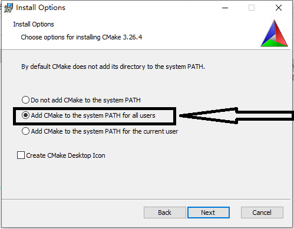

[TOC]

# 预备知识

## CMake是什么

CMake是一个管理代码构建的工具。与平台和构建系统无关。最初CMake只用于生成不同版本的Makefile。现在CMake可以生成不同构建工具构建文件，也可以生成不同IDE（如Visual Studio、XCode）的项目文件。

CMake也可以在一定程度上简化C/C++第三方库的引入与使用流程。

CMake主要用于构建C或C++程序，但是也可以用于其他语言程序的构建。

****&nbsp;

## 环境搭建与学习准备

## 前置条件

如果是用Linux学习，需要先安装GCC、make等工具。Ubuntu上安装命令如下：

```shell
sudo apt install gcc g++ make
```

&nbsp;

如果是用Windows，需要先装有编译工具。建议安装MinGW环境进行学习（用Visual Studio也可以，但是用来学习cmake的话感觉有点笨重），本课程用的编译工具是MinGW，能和课程工具保持一致最好。

MinGW常用有以下两个版本，选择其中一个即可。**w64devkit提供的工具更多，操作更接近Linux**。所以推荐用w64devkit。

w64devkit：https://github.com/skeeto/w64devkit/releases

mingw-builds：https://github.com/niXman/mingw-builds-binaries/releases

> 最好会GCC与Make的基本用法。但不会也没关系，影响不大。

&nbsp;

### Ubuntu安装CMake

```shell
sudo apt install cmake
```

&nbsp;

### Windows安装CMake

cmake官网：https://cmake.org/

下载安装包，直接下载msi版本。安装时将添加到系统环境变量勾选。



安装完成之后测试

```shell
cmake --version
```

&nbsp;

&nbsp;

### 学习材料

1、官方文档：https://cmake.org/cmake/help/latest/

2、tutorial代码：https://cmake.org/cmake/help/latest/_downloads/987664e19bf1c78e58910f17f64df29f/cmake-3.26.4-tutorial-source.zip

&nbsp;

&nbsp;

# CMake Tutorial

## 第一步 起点

### 练习1  最简单的CMake项目

**`CMakeLists.txt`**

```cmake
# TODO 1: 设置CMake最低版本要求为 3.10
cmake_minimum_required(VERSION 3.10)

# TODO 2: 创建一个名为Tutorial的项目
project(Tutorial)

# TODO 3: 为项目添加一个叫做 Tutorial 的可执行文件
# Hint: 一定要指定源文件 tutorial.cxx
add_executable(Tutorial tutorial.cxx)
```

**要点**

 ①<mark>cmake_minimum_required</mark>

用于指定所需cmake最低版本

用法与示例：

```cmake
# 用法
cmake_minimum_required(VERSION <版本号>)
# 示例
cmake_minimum_required(VERSION 3.10)
```

如果当前使用的cmake版本低于所指定的版本，则会报错并且终止执行。

②<mark>project</mark>

指定项目名称

用法与示例：

```cmake
# 用法
project(<项目名>)
# 示例 指定项目名称为Tutorial
project(Tutorial)
```

③<mark>add_executable</mark>

利用指定的源文件在项目中添加可执行文件

用法与示例：

```cmake
# 用法 源文件可以有多个，用空格隔开
add_executable(<可执行文件名> <源文件列表>)
# 示例 可执行文件名为Tutorial，用到的源文件为tutorial.cxx
add_executable(Tutorial tutorial.cxx)
```

④<mark>cmake命令常用执行方法</mark>

```shell
# 用法
cmake -G <生成器名称> <CMakeLists.txt所在的目录>
```

如果使用默认生成器，则-G这部分可以省略，具体支持哪些生成器可以用cmake --help查看

> 扩展：设置环境变量CMAKE_GENERATOR可以指定默认生成器，简化cmake命令的执行

&nbsp;

**课后练习**

1. 自行准备一个或多个源文件，多练习几遍cmake项目的创建与生成可执行文件流程，直到能默写出CMakeLists.txt中的内容并且熟练通过cmake构建出可执行文件。
2. 配置CMAKE_GENERATOR环境变量并修改不同值，通过cmake --help命令查看该变量对默认Generator(生成器)的影响。
3. 如果电脑上有多套环境或工具（例如有MinGW与Visual Studio或CodeBlocks），修改-G指定不同生成器，尝试生成不同工具对应的项目。

&nbsp;

&nbsp;

### 练习2 指定C++标准

**`CMakeLists.txt`**

```cmake
# TODO 1: 设置CMake最低版本要求为 3.10
cmake_minimum_required(VERSION 3.10)

# TODO 2: 创建一个名为Tutorial的项目
project(Tutorial)

# TODO 7: 用上面project命令将项目版本设为 1.0

# TODO 6: 设置变量 CMAKE_CXX_STANDARD 为 11
#          CMAKE_CXX_STANDARD_REQUIRED 为 True
set(CMAKE_CXX_STANDARD 26)
set(CMAKE_CXX_STANDARD_REQUIRED True)

# TODO 8: 用 configure_file 复制 TutorialConfig.h.in 生成
#         TutorialConfig.h

# TODO 3: 为项目添加一个叫做 Tutorial 的可执行文件
# Hint: 一定要指定源文件 tutorial.cxx
add_executable(Tutorial tutorial.cxx)
```

**要点**

①<mark>set</mark>

用于给变量设置值

用法与示例：

```cmake
# 用法
set(<变量名> <变量值>)
# 示例
set(CMAKE_CXX_STANDARD 26)
set(SRC_DIR /home/src)
```

②<mark>CMAKE_CXX_STANDARD</mark>

变量，用于指定C++标准

用法与示例：

```cmake
# 用法 截止2023/6 std_num∈{98,11,14,17,20,23,26}
set(CMAKE_CXX_STANDARD <std_num>)
# 示例
set(CMAKE_CXX_STANDARD 11)
set(CMAKE_CXX_STANDARD 17)
```

> 在C++中可以通过输出__cplusplus查看当前编译器所用的标准
> 
> | __cplusplus的值 | 对应的C++标准 |
> |:-------------:|:--------:|
> | 199711        | C++98    |
> | 201103        | C++11    |
> | 201402        | C++14    |
> | 201703        | C++17    |
> | 202002        | C++20    |
> | 202100        | C++23    |

③<mark>CMAKE_CXX_STANDARD_REQUIRED</mark>

变量，如果设置为True，则通过CMAKE_CXX_STANDARD设置的C++标准是必需的，如果编译器不支持该标准则会输出错误提示信息。如果不设置或者设置为False，则CMAKE_CXX_STANDARD设置的C++标准不是必需的，如果编译器不支持对应的标准，则会使用上一个版本的标准进行编译。

用法与示例：

```cmake
set(CMAKE_CXX_STANDARD_REQUIRED True)
```

&nbsp;

&nbsp;

**课后练习**

1. 在std_num∈{98,11,14,17,20,23,26}的范围内设置C++标准，输出__cplusplus的值并观察规律。
2. 设置std_num∉{98,11,14,17,20,23,26}的C++标准值，观察cmake提示信息并输出__cplusplus的值，总结其规律。
3. 类比C++标准的指定，查询文档或其他资料，补充C语言标准指定方式，并准备几个C语言源文件进行实验。

&nbsp;

&nbsp;

&nbsp;

### 练习3 添加版本号和配置头文件

有些时候需要让源代码能访问CMakeLIsts.txt当中的数据，比如说在CMakeLists.txt中定义版本号之后，希望能在源程序中对版本号进行输出。本节内容为如何让源代码中能访问CMakeLists.txt中的变量数据。

`CMakeLists.txt`

```cmake
# TODO 1: 设置CMake最低版本要求为 3.10
cmake_minimum_required(VERSION 3.10)

# TODO 2: 创建一个名为Tutorial的项目
project(Tutorial VERSION 11.25)

# TODO 7: 用上面project命令将项目版本设为 1.0

# TODO 6: 设置变量 CMAKE_CXX_STANDARD 为 11
#          CMAKE_CXX_STANDARD_REQUIRED 为 True
set(CMAKE_CXX_STANDARD 11)
set(CMAKE_CXX_STANDARD_REQUIRED True)

# set(STR_TEST "Hello World")

# TODO 8: 用 configure_file 复制 TutorialConfig.h.in 生成
#         TutorialConfig.h
configure_file(TutorialConfig.h.in TutorialConfig.h)

# TODO 3: 为项目添加一个叫做 Tutorial 的可执行文件
# Hint: 一定要指定源文件 tutorial.cxx
add_executable(Tutorial tutorial.cxx)

# TODO 9: 用 target_include_directories 添加头文件搜索目录 ${PROJECT_BINARY_DIR}
# PUBLIC PRIVATE INTERFACE
target_include_directories(Tutorial PUBLIC ${PROJECT_BINARY_DIR})
```

`TutorialConfig.h.in`

```c
#define Tutorial_VERSION_MAJOR @Tutorial_VERSION_MAJOR@
#define Tutorial_VERSION_MINOR @Tutorial_VERSION_MINOR@
```

**要点**

〇<mark>project第二种用法</mark>

定义项目名和版本号

```cmake
project(Tutorial VERSION 2.15)
```

①<mark>configure_file</mark>

将输入文件复制为输出文件，并把其中的变量引用替换为CMakeLists.txt中定义的变量，如果变量未定义，则替换为空串。输入文件中的变量引用方式为**@@变量名@@**或者**${变量名}**。

输入文件默认路径为CMakeLists.txt所在的路径，输出文件的路径默认为cmake生成文件所在的路径。

用法与示例：

```cmake
# 用法
configure_file(<inputfile> <outputfile>)
# 示例
configure_file(TutorialConfig.h.in TutorialConfig.h)
```

在输入文件中，用宏定义的方式对变量进行定义

```c
#define Tutorial_VERSION_MAJOR @Tutorial_VERSION_MAJOR@
#define Tutorial_VERSION_MINOR ${Tutorial_VERSION_MINOR}

// 因为CMakeLists.txt中定义的字符串都是裸的，所以如果一个变量的值为字符串，需要用双引号包起来
#define STR_VAR "@STR_VAR@"
```

上述定义中@Tutorial_VERSION_MAJOR@、${Tutorial_VERSION_MINOR}、@STR_VAR@在输出文件中会被替换为CMakeLists.txt中定义的对应变量值。

&nbsp;

②<mark>target_include_directories</mark>

给指定的目标添加头文件搜索路径。

用法与示例：

```cmake
# 用法
target_include_directories(<target> <INTERFACE|PUBLIC|PRIVATE> <dir1 dir2 ...>)

# 示例
target_include_directories(Tutorial PUBLIC ${PROJECT_BINARY_DIR})
```

&nbsp;

③<mark><PROJECT-NAME>_VERSION_MAJOR</mark> 

版本号第一个组成部分。该变量为cmake自动定义的一个变量，不需要手动定义，值来自于project的定义。其中<PROJECT-NAME>为用**project**定义的项目名。

&nbsp;

④<mark><PROJECT-NAME>_VERSION_MINOR</mark>

版本号第二个组成部分。该变量为cmake自动定义的一个变量，不需要手动定义，值来自于project的定义。其中<PROJECT-NAME>为用**project**定义的项目名。

&nbsp;

&nbsp;

**课后练习**

①通过本节学习的内容访问更多CMakeLists.txt中的变量。

②自行探究一下`include_directories`的用法，比较与target_include_directories的异同。

&nbsp;

&nbsp;

&nbsp;

## 第二步 加个库

### 练习1 创建库文件

前面的练习当中创建了可执行文件。本节将学习如何创建库文件以及库文件的使用 。同时也将练习将一个项目划分为多个子目录的方法。

`CMakeLists.txt`

```cmake
cmake_minimum_required(VERSION 3.10)

# set the project name and version
project(Tutorial VERSION 1.0)

# specify the C++ standard
set(CMAKE_CXX_STANDARD 11)
set(CMAKE_CXX_STANDARD_REQUIRED True)

# TODO 7: Create a variable USE_MYMATH using option and set default to ON


# configure a header file to pass some of the CMake settings
# to the source code
configure_file(TutorialConfig.h.in TutorialConfig.h)

# TODO 8: Use list() and APPEND to create a list of optional libraries
# called  EXTRA_LIBS and a list of optional include directories called
# EXTRA_INCLUDES. Add the MathFunctions library and source directory to
# the appropriate lists.
#
# Only call add_subdirectory and only add MathFunctions specific values
# to EXTRA_LIBS and EXTRA_INCLUDES if USE_MYMATH is true.

# TODO 2: Use add_subdirectory() to add MathFunctions to this project

add_subdirectory(MathFunctions)


# add the executable
add_executable(Tutorial tutorial.cxx)

# TODO 9: Use EXTRA_LIBS instead of the MathFunctions specific values
# in target_link_libraries.

# TODO 3: Use target_link_libraries to link the library to our executable
target_link_libraries(Tutorial PUBLIC MathFunctions)

# TODO 4: Add MathFunctions to Tutorial's target_include_directories()
# Hint: ${PROJECT_SOURCE_DIR} is a path to the project source. AKA This folder!

# TODO 10: Use EXTRA_INCLUDES instead of the MathFunctions specific values
# in target_include_directories.

# add the binary tree to the search path for include files
# so that we will find TutorialConfig.h
target_include_directories(Tutorial PUBLIC
                           "${PROJECT_BINARY_DIR}"
                           "${PROJECT_SOURCE_DIR}/MathFunctions"
                           )
```

`MathFunctions/CMakeLists.txt`

```cmake
# TODO 1: Add a library called MathFunctions
# Hint: You will need the add_library command
add_library(MathFunctions mysqrt.cxx)
```

**要点**

①<mark>add_subdirectory</mark>

为当前项目添加子目录。子目录当中必须包含一个CMakeLists.txt文件，其中可以不写cmake_minimum_required与project。

用法与示例：

```cmake
# 用法
add_subdirectory(<source_dir>)
# 示例
add_subdirectory(MathFunctions)
```

②<mark>target_link_libraries</mark>

为指定目录指定链接库。

用法与示例：

```cmake
# 用法
target_link_libraries(<target> ... <item>... ...)
# 示例
target_link_libraries(Tutorial PUBLIC MathFunctions)
```

③<mark>PROJECT_SOURCE_DIR</mark>

最后一次调用project的CMakeLists.txt文件所在的目录。

④<mark>add_library</mark>

用指定的源文件生成库文件。

用法与示例：

```cmake
# 用法
add_library(<name> [<source>...])
# 示例
add_library(MathFunctions mysqrt.cxx MathFunctions.h)
```

&nbsp;

&nbsp;

### 练习2 库文件可选编译

本节内容为设置库文件（子目录）可选编译。

```cmake
cmake_minimum_required(VERSION 3.10)

# set the project name and version
project(Tutorial VERSION 1.0)

# specify the C++ standard
set(CMAKE_CXX_STANDARD 11)
set(CMAKE_CXX_STANDARD_REQUIRED True)

# TODO 7: Create a variable USE_MYMATH using option and set default to ON
option(USE_MYMATH "Use My Math?" OFF)

# configure a header file to pass some of the CMake settings
# to the source code
configure_file(TutorialConfig.h.in TutorialConfig.h)

# TODO 8: Use list() and APPEND to create a list of optional libraries
# called  EXTRA_LIBS and a list of optional include directories called
# EXTRA_INCLUDES. Add the MathFunctions library and source directory to
# the appropriate lists.
#
# Only call add_subdirectory and only add MathFunctions specific values
# to EXTRA_LIBS and EXTRA_INCLUDES if USE_MYMATH is true.

# TODO 2: Use add_subdirectory() to add MathFunctions to this project
if(USE_MYMATH)
    add_subdirectory(MathFunctions)
    list(APPEND EXTRA_LIBS MathFunctions)
    list(APPEND EXTRA_INCLUDES "${PROJECT_SOURCE_DIR}/MathFunctions")
endif()


# add the executable
add_executable(Tutorial tutorial.cxx)

# TODO 9: Use EXTRA_LIBS instead of the MathFunctions specific values
# in target_link_libraries.

# TODO 3: Use target_link_libraries to link the library to our executable
target_link_libraries(Tutorial PUBLIC ${EXTRA_LIBS})

# TODO 4: Add MathFunctions to Tutorial's target_include_directories()
# Hint: ${PROJECT_SOURCE_DIR} is a path to the project source. AKA This folder!

# TODO 10: Use EXTRA_INCLUDES instead of the MathFunctions specific values
# in target_include_directories.

# add the binary tree to the search path for include files
# so that we will find TutorialConfig.h
target_include_directories(Tutorial PUBLIC
                           "${PROJECT_BINARY_DIR}"
                           "${EXTRA_INCLUDES}"
                           )
```

**要点**

①<mark>option</mark>

提供一个布尔变量，可以让用户自行选择。

用法与示例：

```cmake
# 用法
option(<variable> "<help_text>" [value])
# 示例
option(USE_MYMATH "Use MyMath" ON)
```

`value`值为`ON`或`OFF`，默认值为`OFF`。

在执行配置时，可以用`-D`来指定值，例如

```shell
cmake . -DUSE_MYMATH=OFF
```

②<mark>if()</mark>&nbsp;&&nbsp;<mark>endif()</mark>

条件判断开始与结束。

语法：

```cmake
if(<condition>)
  <commands>
elseif(<condition>)
  <commands>
else()
  <commands>
endif()
```

| \<condition\>判断为真的值 | \<condition\>判断为假的值    |
|:-------------------:|:----------------------:|
| 1                   | 0                      |
| ON                  | OFF                    |
| TRUE                | FALSE                  |
| YES                 | NO                     |
| Y                   | N                      |
| 其他非0数               | IGNORE                 |
|                     | NOTFOUND或以-NOTFOUND结尾的 |
|                     | 值不是判断为真的字符串            |

③<mark>list</mark>

列表操作。详细操作见[list](#)，这里只讲用到的APPEND操作。将一些元素追加到已有的列表当中。如果列表变量还未定义，则会当做空列表处理。

语法与示例：

```cmake
# 语法
list(APPEND <list> [<element> ...])
# 示例 将MathFunctions追加到EXTRA_LIBS当中
list(APPEND EXTRA_LIBS MathFunctions)
```

④<mark>cmakedefine</mark>

用法与#define相同，用在configure_file的输入文件当中进行宏定义。

不同点在于，#define本身就是C/C++当中的宏定义，所以不论对应的变量是否在CMakeLists.txt中有定义，都会在输出文件中定义一个宏。而#cmakedfine则会根据变量在CMakeLists.txt中的定义情况来确定是否会在输出文件中定义宏。如果变量在CMakeLists.txt中没有定义或都已定义但是一个判断为假的布尔值，则不会在输出文件中定义对应的宏，如果变量在CMakeLists.txt中有定义且不为布尔值、或者为布尔值但判断为真，则会在输出文件中定义对应的宏。

用法示例：

```c
#cmakedefine USE_MYMATH
```

&nbsp;

&nbsp;

## 第三步 添加使用依赖

### 练习1 为库添加使用依赖

`CMakeLists.txt`

```cmake
cmake_minimum_required(VERSION 3.10)

# set the project name and version
project(Tutorial VERSION 1.0)

# specify the C++ standard
set(CMAKE_CXX_STANDARD 11)
set(CMAKE_CXX_STANDARD_REQUIRED True)

# should we use our own math functions
option(USE_MYMATH "Use tutorial provided math implementation" ON)
message(STATUS "OUT --- ${CMAKE_CURRENT_SOURCE_DIR}")

# configure a header file to pass some of the CMake settings
# to the source code
configure_file(TutorialConfig.h.in TutorialConfig.h)

# TODO 2: 删除EXTRA_INCLUDES

# add the MathFunctions library
if(USE_MYMATH)
  add_subdirectory(MathFunctions)
  list(APPEND EXTRA_LIBS MathFunctions)
endif()

# add the executable
add_executable(Tutorial tutorial.cxx)

target_link_libraries(Tutorial PUBLIC ${EXTRA_LIBS})

# TODO 3: 删除EXTRA_INCLUDES

# add the binary tree to the search path for include files
# so that we will find TutorialConfig.h
target_include_directories(Tutorial PUBLIC
                           "${PROJECT_BINARY_DIR}"
                           )
```

`MathFunctions/CMakeLists.txt`

```cmake
add_library(MathFunctions mysqrt.cxx)

# TODO 1: 声明所有需要链接MathFunctions库的都要在头文件搜索中加入当前当前目录，但是MathFunctions本身不需要
# Hint: 用target_include_directories和INTERFACE  
# PUBLIC 本目标需要用，依赖这个目标的其他目标也需要用
# INTERFACE  本目标不需要，依赖本目标的其他目标需要
# PRIVATE 本目标需要，依赖这个目标的其他目标不需要
target_include_directories(MathFunctions INTERFACE "${CMAKE_CURRENT_SOURCE_DIR}")
message(STATUS "MathFunction --- ${CMAKE_CURRENT_SOURCE_DIR}")
```

**要点**

①<mark>PUBLIC | INTERFACE | PRIVATE</mark>

在使用`target_include_directories`和`target_link_libraries`添加搜索目录时，有三个修饰符`PUBLIC | INTERFACE | PRIVATE`，其含义如下：

**PUBLIC**：当前目标和以当前目标为依赖的目标都能能使用添加的目录，都能在对应的目录中进行搜索

**PRIVATE**：只有当前目标能使用添加的目录，以当前目标为依赖的目标不能使用

**INTERFACE**：以当前目标为依赖的目标需要使用添加的目录，但当前目标不需要用这种方式添加对应搜索目录时用INTERFACE。

&nbsp;

②<mark>CMAKE_CURRENT_SOURCE_DIR</mark>

变量。当前CMakeLists.txt所在的目录。

&nbsp;

**课后练习**

①找一个外部的头文件目录，分别在两个cxx文件里引用，并用本节内容方法在MathFunctions/CMakeLists.txt里添加使用依赖，分别使用PUBLIC | INTERFACE | PRIVATE修饰符，查看编译报错信息，验证本节所讲知识点。

&nbsp;

&nbsp;

## 第四步 生成器表达式

### 练习1 用接口库设置C++标准

`CMakeLists.txt`

```cmake
# TODO 4: Update the minimum required version to 3.15

cmake_minimum_required(VERSION 3.10)

# set the project name and version
project(Tutorial VERSION 1.0)

# TODO 1: 将下面的代码替换为:
# * 创建一个interface库tutorial_compiler_flags
#   Hint: use add_library() with the INTERFACE signature
# * 添加编译特性cxx_std_11到tutorial_compiler_flags
#   Hint: Use target_compile_features()
add_library(tutorial_compiler_flags INTERFACE)
target_compile_features(tutorial_compiler_flags INTERFACE cxx_std_14)


# TODO 5: 创建一些辅助变量用来确定用的是哪个编译器:
# * 创建一个变量gcc_like_cxx如果用的是CXX并且用的是下列任意一个编译器那么值为true
#         ARMClang, AppleClang, Clang, GNU, LCC
# * 创建一个变量msvc_cxx如果用的是CXX和MSVC那么值为true
# Hint: Use set() and COMPILE_LANG_AND_ID

# TODO 6: 向interface库tutorial_compiler_flags中添加警告选项：
# 
# * 如果是gcc_like_cxx, 添加 -Wall;-Wextra;-Wshadow;-Wformat=2;-Wunused
# * 如果是msvc_cxx, 添加 -W3
# Hint: Use target_compile_options()

# TODO 7: 用嵌套生成器表达式, 只在构建的时警告
# 
# Hint: Use BUILD_INTERFACE

# should we use our own math functions
option(USE_MYMATH "Use tutorial provided math implementation" ON)

# configure a header file to pass some of the CMake settings
# to the source code
configure_file(TutorialConfig.h.in TutorialConfig.h)

# add the MathFunctions library
if(USE_MYMATH)
  add_subdirectory(MathFunctions)
  list(APPEND EXTRA_LIBS MathFunctions)
endif()

# add the executable
add_executable(Tutorial tutorial.cxx)

# TODO 2: 链接tutorial_compiler_flags

target_link_libraries(Tutorial PUBLIC ${EXTRA_LIBS} tutorial_compiler_flags)

# add the binary tree to the search path for include files
# so that we will find TutorialConfig.h
target_include_directories(Tutorial PUBLIC
                           "${PROJECT_BINARY_DIR}"
                           )
```

`MathFunctions/CMakeLists.txt`

```cmake
add_library(MathFunctions mysqrt.cxx)

# state that anybody linking to us needs to include the current source dir
# to find MathFunctions.h, while we don't.
target_include_directories(MathFunctions
          INTERFACE ${CMAKE_CURRENT_SOURCE_DIR}
          )

# TODO 3: 链接tutorial_compiler_flags
target_link_libraries(MathFunctions PUBLIC tutorial_compiler_flags)
```

**要点**

①<mark>INTERFACE库</mark>

使用`add_library(<libname> INTERFACE)`可以创建个Interface库，这样的库并不是真实存在的，是一个虚拟的库，通常用来传递一些选项。用法和正常的库一样，可通过`target_link_libraries`链接到目标，可以向指定的目标传递一些指定的参数选项。

&nbsp;

②<mark>target_compile_features</mark>

`target_compile_features` 是 CMake 用来指定编译器特性的命令。它可以用来指定编译器需要支持的 C++ 标准或者其他编译器特性。具体支持的特性取决于编译器版本和 CMake 版本。

语法与示例

```cmake
target_compile_features(<target> <PRIVATE|PUBLIC|INTERFACE> <feature> [...])

# 示例
target_compile_features(tutorial_compiler_flags INTERFACE cxx_std_11)
```

以下是一些常见的特性：

- `cxx_std_11`：指定 C++11 标准。
- `cxx_std_14`：指定 C++14 标准。
- `cxx_std_17`：指定 C++17 标准。
- `cxx_std_20`：指定 C++20 标准。
- `cxx_constexpr`：启用 C++11 constexpr 函数。
- `cxx_nullptr`：启用 C++11 nullptr 关键字。
- `cxx_auto_type`：启用 C++11 auto 关键字。
- `cxx_lambdas`：启用 C++11 lambda 表达式。
- `cxx_range_for`：启用 C++11 range-based for 循环。
- `cxx_override`：启用 C++11 override 关键字。
- `cxx_final`：启用 C++11 final 关键字。

&nbsp;

### 练习2 添加编译警告选项

**CMakeLists.txt解析过程**

CMake构建过程分为两个阶段

1. 配置阶段，CMake 会读取项目的 CMakeLists.txt 文件，并根据其中的指令和参数来生成 Makefile 或者 IDE 的项目文件
   - 检查编译器和工具链是否可用，并设置编译器选项和链接选项
   - 检查系统库和第三方库是否可用，并设置库的路径和链接选项
   - 检查项目的源代码文件，并设置编译选项和链接选项
   - 生成 Makefile 或者 IDE 的项目文件
   - 根据不同的平台和编译器生成不同的 Makefile 或者项目文件，以保证项目可以在不同的平台和编译器上构建
2. 生成阶段，CMake 会根据配置阶段生成的 Makefile 或者项目文件来执行实际的构建操作
   - 根据 Makefile 或者项目文件中的指令和参数来编译源代码文件，并生成目标文件
   - 根据 Makefile 或者项目文件中的指令和参数来链接目标文件，并生成可执行文件或者库文件

&nbsp;

**生成器表达式**

CMake生成器表达式是一种特殊的语法，用于在CMake构建系统中动态地生成构建规则。它们可以用于指定编译器选项、链接选项等。

本节先学习其中两种表达式：

**$\<condition:true_string\>**

* 如果`condition`为1，则此表达式结果为`true_string`
* 如果`condition`为0，则此表达式结果为空

**$\<COMPILE_LANG_AND_ID:language,compiler_ids\>**

- 如果当前所用的语言与`language`一致且编译器ID在`compiler_ids`的列表中，则表达式值为1，否则为0
- `language`值主要为`CXX`和`C`
- `compiler_ids`主要有GNU、Clang、MSVC等，有多个时用逗号隔开

生成器表达式因为是在生成阶段可用，所以不能在配置阶段进行输出 ，可用下面方式调式

```cmake
add_custom_target(ged COMMAND ${CMAKE_COMMAND} -E echo "$<1:hello>")
```

配置完成之后，用以下命令进行输出

```shell
cmake --build . --target ged
# 用make可简写
make ged
```

但不是所有的表达式都能这样输出，有的表达式无法输出，比如`$<COMPILE_LANG_AND_ID:CXX,ARMClang,AppleClang,Clang,GNU,LCC>`

&nbsp;

```cmake
# TODO 4: Update the minimum required version to 3.15

cmake_minimum_required(VERSION 3.15)

# set the project name and version
project(Tutorial VERSION 1.0)

# TODO 1: 将下面的代码替换为:
# * 创建一个interface库tutorial_compiler_flags
#   Hint: use add_library() with the INTERFACE signature
# * 添加编译特性cxx_std_11到tutorial_compiler_flags
#   Hint: Use target_compile_features()
add_library(tutorial_compiler_flags INTERFACE)
target_compile_features(tutorial_compiler_flags INTERFACE cxx_std_14)

# add_custom_target(ged COMMAND ${CMAKE_COMMAND} -E echo "$<COMPILE_LANG_AND_ID:CXX,GNU>")

# TODO 5: 创建一些辅助变量用来确定用的是哪个编译器:
# * 创建一个变量gcc_like_cxx如果用的是CXX并且用的是下列任意一个编译器那么值为true
#         ARMClang, AppleClang, Clang, GNU, LCC
# * 创建一个变量msvc_cxx如果用的是CXX和MSVC那么值为true
# Hint: Use set() and COMPILE_LANG_AND_ID
set(gcc_like_cxx "$<COMPILE_LANG_AND_ID:CXX,ARMClang,AppleClang,Clang,GNU,LCC>")
set(msvc_cxx "$<COMPILE_LANG_AND_ID:CXX,MSVC>")


# TODO 6: 向interface库tutorial_compiler_flags中添加警告选项：
# 
# * 如果是gcc_like_cxx, 添加 -Wall;-Wextra;-Wshadow;-Wformat=2;-Wunused
# * 如果是msvc_cxx, 添加 -W3
# Hint: Use target_compile_options()
target_compile_options(tutorial_compiler_flags INTERFACE 
  "$<${gcc_like_cxx}:-Wall;-Wextra;-Wshadow;-Wformat=2;-Wunused>"
  "$<${msvc_cxx}:-W3>"
)

# TODO 7: 用嵌套生成器表达式, 只在构建的时警告
# 
# Hint: Use BUILD_INTERFACE

# should we use our own math functions
option(USE_MYMATH "Use tutorial provided math implementation" ON)

# configure a header file to pass some of the CMake settings
# to the source code
configure_file(TutorialConfig.h.in TutorialConfig.h)

# add the MathFunctions library
if(USE_MYMATH)
  add_subdirectory(MathFunctions)
  list(APPEND EXTRA_LIBS MathFunctions)
endif()

# add the executable
add_executable(Tutorial tutorial.cxx)

# TODO 2: 链接tutorial_compiler_flags

target_link_libraries(Tutorial PUBLIC ${EXTRA_LIBS} tutorial_compiler_flags)

# add the binary tree to the search path for include files
# so that we will find TutorialConfig.h
target_include_directories(Tutorial PUBLIC
                           "${PROJECT_BINARY_DIR}"
                           )
```

**要点**

①<mark>target_compile_options</mark>

给指定的目标添加编译选项。

语法及示例：

```cmake
target_compile_options(<target> [BEFORE]
  <INTERFACE|PUBLIC|PRIVATE> [items1...]
  [<INTERFACE|PUBLIC|PRIVATE> [items2...] ...])

# 示例
target_compile_options(Tutorial PUBLIC -std=c++11 -Wunused)
```

&nbsp;

**课后练习**

①有余力的同学自行探究一下生成器表达式的其他内容。

&nbsp;

&nbsp;

## 第五步 安装与测试

### 练习1 安装规则

`CMakeLists.txt`

```cmake
cmake_minimum_required(VERSION 3.15)

# set the project name and version
project(Tutorial VERSION 1.0)

# specify the C++ standard
add_library(tutorial_compiler_flags INTERFACE)
target_compile_features(tutorial_compiler_flags INTERFACE cxx_std_11)

# add compiler warning flags just when building this project via
# the BUILD_INTERFACE genex
set(gcc_like_cxx "$<COMPILE_LANG_AND_ID:CXX,ARMClang,AppleClang,Clang,GNU,LCC>")
set(msvc_cxx "$<COMPILE_LANG_AND_ID:CXX,MSVC>")
target_compile_options(tutorial_compiler_flags INTERFACE
  "$<${gcc_like_cxx}:$<BUILD_INTERFACE:-Wall;-Wextra;-Wshadow;-Wformat=2;-Wunused>>"
  "$<${msvc_cxx}:$<BUILD_INTERFACE:-W3>>"
)

# should we use our own math functions
option(USE_MYMATH "Use tutorial provided math implementation" ON)

# configure a header file to pass some of the CMake settings
# to the source code
configure_file(TutorialConfig.h.in TutorialConfig.h)

# add the MathFunctions library
if(USE_MYMATH)
  add_subdirectory(MathFunctions)
  list(APPEND EXTRA_LIBS MathFunctions)
endif()

# add the executable
add_executable(Tutorial tutorial.cxx)
target_link_libraries(Tutorial PUBLIC ${EXTRA_LIBS} tutorial_compiler_flags)

# add the binary tree to the search path for include files
# so that we will find TutorialConfig.h
target_include_directories(Tutorial PUBLIC
                           "${PROJECT_BINARY_DIR}"
                           )

# TODO 3: 安装 Tutorial 到 bin 目录  ${CMAKE_INSTALL_PREFIX}
# Hint: Use the TARGETS and DESTINATION parameters
# install(TARGETS targets... [DESTINATION <dir>])
install(TARGETS Tutorial DESTINATION bin)
message(STATUS "${CMAKE_INSTALL_PREFIX}")

# TODO 4: 安装TutorialConfig.h到include目录
# Hint: Use the FILES and DESTINATION parameters
install(FILES "${PROJECT_BINARY_DIR}/TutorialConfig.h" DESTINATION include)
```

`MathFunctions/CMakeLists.txt`

```cmake
add_library(MathFunctions mysqrt.cxx)

target_include_directories(MathFunctions
          INTERFACE ${CMAKE_CURRENT_SOURCE_DIR}
          )

target_link_libraries(MathFunctions tutorial_compiler_flags)

set(installable_libs MathFunctions tutorial_compiler_flags)
if(TARGET SqrtLibrary)
  list(APPEND installable_libs SqrtLibrary)
endif()
install(TARGETS ${installable_libs} DESTINATION lib)

install(FILES MathFunctions.h DESTINATION include)
```

**要点**

①<mark>if(TARGET target-name)</mark>

- 如果`target-name`是一个已经调用`add_executable`、`add_library`、`add_custom_target`创建的目标，则返回True

```cmake

```

②<mark>install</mark>

用于定义安装规则。

语法与示例（简洁版）

```cmake
# 安装生成的目标文件
install(TARGETS <目标名列表> DESTINATION <安装位置>)
# 安装其他文件
install(FILES <文件列表> DESTINATION <安装位置>)
```

安装多个文件时，用空格隔开。安装位置是相对于`CMAKE_INSTALL_PREFIX`的，`CMAKE_INSTALL_PREFIX`是安装时的默认路径，可以自行用`set`设置。

运行安装：

安装到默认路径下

```shell
cmake --install .
```

如果有多个生成版本，指定安装版本

```shell
cmake --install . --config Release
```

如果用的是IDE，用下列命令

```shell
cmake --build . --target install --config Debug
```

自行指定安装路径

```shell
cmake --install . --prefix "/path/to/your/installdir"
```

&nbsp;

### 练习2 测试支持

`CTest`提供了一些测试管理。本节内容为给可执行文件创建单元测试。

```cmake
cmake_minimum_required(VERSION 3.15)

# set the project name and version
project(Tutorial VERSION 1.0)

# specify the C++ standard
add_library(tutorial_compiler_flags INTERFACE)
target_compile_features(tutorial_compiler_flags INTERFACE cxx_std_11)

# add compiler warning flags just when building this project via
# the BUILD_INTERFACE genex
set(gcc_like_cxx "$<COMPILE_LANG_AND_ID:CXX,ARMClang,AppleClang,Clang,GNU,LCC>")
set(msvc_cxx "$<COMPILE_LANG_AND_ID:CXX,MSVC>")
target_compile_options(tutorial_compiler_flags INTERFACE
  "$<${gcc_like_cxx}:$<BUILD_INTERFACE:-Wall;-Wextra;-Wshadow;-Wformat=2;-Wunused>>"
  "$<${msvc_cxx}:$<BUILD_INTERFACE:-W3>>"
)

# should we use our own math functions
option(USE_MYMATH "Use tutorial provided math implementation" ON)

# configure a header file to pass some of the CMake settings
# to the source code
configure_file(TutorialConfig.h.in TutorialConfig.h)

# add the MathFunctions library
if(USE_MYMATH)
  add_subdirectory(MathFunctions)
  list(APPEND EXTRA_LIBS MathFunctions)
endif()

# add the executable
add_executable(Tutorial tutorial.cxx)
target_link_libraries(Tutorial PUBLIC ${EXTRA_LIBS} tutorial_compiler_flags)

# add the binary tree to the search path for include files
# so that we will find TutorialConfig.h
target_include_directories(Tutorial PUBLIC
                           "${PROJECT_BINARY_DIR}"
                           )

# TODO 3: 安装 Tutorial 到 bin 目录  ${CMAKE_INSTALL_PREFIX}
# Hint: Use the TARGETS and DESTINATION parameters
# install(TARGETS targets... [DESTINATION <dir>])
# target: add_excutable add_library
install(TARGETS Tutorial DESTINATION bin)
message(STATUS "${CMAKE_INSTALL_PREFIX}")

# TODO 4: 安装TutorialConfig.h到include目录
# Hint: Use the FILES and DESTINATION parameters
install(FILES "${PROJECT_BINARY_DIR}/TutorialConfig.h" DESTINATION include)

# TODO 5: Enable testing
enable_testing()

# TODO 6: 添加一个Runs测试，运行下面的命令:
# $ Tutorial 25
add_test(NAME Runs COMMAND Tutorial 25)

# TODO 7: 添加一个叫Usage的测试，执行下面的命令:
# $ Tutorial
# 要保证输出期望的内容.
# Hint: 用PASS_REGULAR_EXPRESSION属性匹配"Usage.*number"
add_test(NAME Usage COMMAND Tutorial)
set_tests_properties(Usage PROPERTIES PASS_REGULAR_EXPRESSION "Usage.*number")

# TODO 8: 再添加一个运行下面命令的测试:
# $ Tutorial 4
# 保证输出结果是正确的.
# Hint: 用PASS_REGULAR_EXPRESSION属性匹配"4 is 2"
add_test(NAME Com4 COMMAND Tutorial 4)
set_tests_properties(Com4 PROPERTIES PASS_REGULAR_EXPRESSION "4 is 2")


# TODO 9: 添加更多测试. 创建一个函数do_test完成重复内容
# 测试以下数值: 4, 9, 5, 7, 25, -25 and 0.0001.
function(do_test num result)
  add_test(NAME Com${num} COMMAND Tutorial ${num})
  set_tests_properties(Com${num} PROPERTIES PASS_REGULAR_EXPRESSION "${num} is ${result}")
endfunction()

do_test(9 3)
do_test(5 2.236)
do_test(7 2.645)
do_test(-25 "(-nan|nan|0)") # not a number
do_test(0.0001 0.001)


# 5 2.236
# 7 2.645
# -25 "(-nan|nan|0)"
# 0.0001 0.001
# do_test(4 2)
```

**要点**

①<mark>enable_testing()</mark>

开启当前目录及子目录的测试支持。

②<mark>add_test</mark>

添加一条测试

简版用法：

```cmake
add_test(NAME <name> COMMAND <command> [<arg>...])
```

- `name`为本条测试名称
- `command`测试用的命令
- `arg`传递测试命令的参数

③<mark>set_tests_properties</mark>

设置测试的属性。

语法

```cmake
set_tests_properties(test1 [test2...] PROPERTIES prop1 value1 prop2 value2)
```

- `test1...`为用add_test添加的测试名
- `prop1`为需要设置的属性名，本节中只学`PASS_REGULAR_EXPRESSION`，表示测试程序的输出结果需要能匹配`value`所表示的正则表达式才能通过，如果匹配不了则不通过。
- `value`要设置的属性值

示例

```cmake
set_tests_properties(Usage
  PROPERTIES PASS_REGULAR_EXPRESSION "Usage:.*number"
  )
```

表示运行`Usage`这个测试时测试程序的输出结果要能正则匹配到"Usage:.*number"。

④<mark>function()与endfunction()</mark>

用于在定义函数，分别表示函数开始与函数结束

语法

```cmake
function(<name> [<arg1> ...])
  <commands>
endfunction()
```

- 括号里第一个参数为函数名，后面是参数列表，可以有多个，多个参数用空格隔开

示例：

```cmake
# 定义
function(do_test target arg result)
  add_test(NAME Comp${arg} COMMAND ${target} ${arg})
  set_tests_properties(Comp${arg}
    PROPERTIES PASS_REGULAR_EXPRESSION ${result}
    )
endfunction()

# 调用
do_test(Tutorial 4 "4 is 1")
```

&nbsp;

&nbsp;

## 第六步 添加测试面板支持

### 练习1 发送测试结果到测试面板

`CMakeLists.txt`

```cmake
# 将enable_testing()替换为下面这行
include(CTest)
```

在build目录执行

```shell
cmake -G "MinGW Makefiles" ..
```

之后执行

```shell
ctest -VV -D Experimental
```

即可。

完成之后可在https://my.cdash.org/index.php?project=CMakeTutorial查看提交的测试结果。

&nbsp;

&nbsp;

## 第七步 添加系统特性检查

### 练习1 评估依赖可用性

`MathFunctions/CMakeLists.txt`

```cmake
add_library(MathFunctions mysqrt.cxx)

# state that anybody linking to us needs to include the current source dir
# to find MathFunctions.h, while we don't.
target_include_directories(MathFunctions
          INTERFACE ${CMAKE_CURRENT_SOURCE_DIR}
          )

# link our compiler flags interface library
target_link_libraries(MathFunctions tutorial_compiler_flags)

# TODO 1: Include CheckCXXSourceCompiles
include(CheckCXXSourceCompiles)

# TODO 2:用check_cxx_source_compiles和简单C++代码检测
# 以下两个函数是否可用:
# * std::log ln
# * std::exp e^2
# 把结果存在HAVE_LOG 和 HAVE_EXP 中.

# Hint: Sample C++ code which uses log:
# #include <cmath>
# int main() {
#   std::log(1.0);
#   return 0;
# }


check_cxx_source_compiles("
#include <cmath>
int main() {
  std::log(1.0);
  return 0;
}
" HAVE_LOG)

check_cxx_source_compiles("
#include <cmath>
int main() {
  std::exp(1.0);
  return 0;
}
" HAVE_EXP)

# TODO 3: 如果HAVE_LOG和HAVE_EXP为真, 添加预编译定义
# "HAVE_LOG"和"HAVE_EXP"到目标MathFunctions上.
#Hint: Use target_compile_definitions()
if(HAVE_LOG AND HAVE_EXP)
    target_compile_definitions(MathFunctions PRIVATE "HAVE_LOG" "HAVE_EXP")
endif()


# install libs
set(installable_libs MathFunctions tutorial_compiler_flags)
install(TARGETS ${installable_libs} DESTINATION lib)
# install include headers
install(FILES MathFunctions.h DESTINATION include)
```

**要点**

①<mark>include</mark>

用于导入其他CMake文件或模块。

```cmake
include(<file|module> [OPTIONAL] [RESULT_VARIABLE <var>]
                      [NO_POLICY_SCOPE])
```

②<mark>check_cxx_source_compiles</mark>

检查给定的C++代码能不能编译及链接成可执行文件。通常用来检查当前环境中是否具有某些特性。

用法

```cmake
check_cxx_source_compiles(<code> <resultVar> [FAIL_REGEX <regex1> [<regex2>...]])
```

- `code`为需要检查的代码，需要包含`main`函数
- `resultVar`为检查结果，如果成功返回布尔真，否则返回布尔假
- `FAIL_REGEX`如果提供，则返回为假的结果需要能匹配上对应的正则表达式

③<mark>target_compile_definitions</mark>

为指定可执行文件及库文件这类目标添加编译器定义，用来控制代码中的条件编译。有点类似于`#cmakedefine`与`configure_file`的作用，但这两个操作的结果会生成一个文件再进行引用，而`target_compile_definitions`不会生成文件。

用法

```cmake
target_compile_definitions(<target>
  <INTERFACE|PUBLIC|PRIVATE> [items1...]
  [<INTERFACE|PUBLIC|PRIVATE> [items2...] ...])
```

示例

```cmake
target_compile_definitions(MathFunctions PRIVATE "HAVE_LOG" "HAVE_EXP")
```

&nbsp;

&nbsp;

## 第八步 添加自定义命令及用自定义命令生成文件

在Linux中，有许多的工具命令，例如`ls`、`mv`、`mkdir`等。在CMake项目中，可以用源代码写一些自定义小工具，然后在CMake中进行调用，来完成一些工作。

本节的内容为自定义一个`MakeTable`命令用来生成指定范围整数的平方根并保存到文件中，在计算的时候可以用这些已经计算好的值来辅助计算。

`MathFunctions/CMakeLists.txt`

```cmake
add_library(MathFunctions mysqrt.cxx Table.h)

add_executable(MakeTable MakeTable.cxx)
add_custom_command(
  OUTPUT ${CMAKE_CURRENT_BINARY_DIR}/Table.h
  COMMAND MakeTable ${CMAKE_CURRENT_BINARY_DIR}/Table.h
  DEPENDS MakeTable
)


# state that anybody linking to us needs to include the current source dir
# to find MathFunctions.h, while we don't.
target_include_directories(MathFunctions
          INTERFACE ${CMAKE_CURRENT_SOURCE_DIR}
          PRIVATE ${CMAKE_CURRENT_BINARY_DIR}
          )

# link our compiler flags interface library
target_link_libraries(MathFunctions tutorial_compiler_flags)

# does this system provide the log and exp functions?
include(CheckCXXSourceCompiles)
check_cxx_source_compiles("
  #include <cmath>
  int main() {
    std::log(1.0);
    return 0;
  }
" HAVE_LOG)
check_cxx_source_compiles("
  #include <cmath>
  int main() {
    std::exp(1.0);
    return 0;
  }
" HAVE_EXP)

# add compile definitions
if(HAVE_LOG AND HAVE_EXP)
  target_compile_definitions(MathFunctions
                             PRIVATE "HAVE_LOG" "HAVE_EXP")
endif()

# install libs
set(installable_libs MathFunctions tutorial_compiler_flags)
install(TARGETS ${installable_libs} DESTINATION lib)
# install include headers
install(FILES MathFunctions.h DESTINATION include)
```

**要点**

①<mark>add_custom_command</mark>

执行自定义指令。

简版用法

```cmake
add_custom_command(OUTPUT output1
                   COMMAND command1
                   DEPENDS depends)
```

- `OUTPUT`指定输出文件名
- `COMMAND`指定要执行的指令
- `DEPENDS`执行指令需要依赖的内容。如果是由`add_executable`或`add_library`添加的目标名，写这一条可以保证对应目标的生成。

&nbsp;

&nbsp;

## 第九步 打包安装程序

发布程序可以有多种形式，比如安装包、压缩包、源文件等。CMake也提供了打包程序`cpack`可将程序打包成多种形式。

只需要在顶层CMakelists.txt中添加以下代码

```cmake
include(InstallRequiredSystemLibraries)
set(CPACK_RESOURCE_FILE_LICENSE "${CMAKE_CURRENT_SOURCE_DIR}/License.txt")
set(CPACK_PACKAGE_VERSION_MAJOR "${Tutorial_VERSION_MAJOR}")
set(CPACK_PACKAGE_VERSION_MINOR "${Tutorial_VERSION_MINOR}")
set(CPACK_SOURCE_GENERATOR "TGZ")
include(CPack)
```

在项目构建完成之后，可以直接执行

```shell
cpack
```

在Windows上默认情况会打包成.exe文件，所以需要先安装一个exe打包程序NSIS(Null Soft Installer)

NSIS下载地址：https://sourceforge.net/projects/nsis/

也可以指定生成器打包成对应的格式

```shell
cpack -G ZIP # 打包成ZIP
```

具体生成器各类可以通过`cpack --help`查看

对于多配置项目，可以指定打包配置

```shell
cpack -C Debug # 打包Debug版本
```

也可以打包源代码

```shell
cpack --config CPackSourceConfig.cmake
```

&nbsp;

&nbsp;

## 第十步 选择静态链接库或动态链接库

`CMakeLists.txt`

```cmake
cmake_minimum_required(VERSION 3.15)

# set the project name and version
project(Tutorial VERSION 1.0)

# specify the C++ standard
add_library(tutorial_compiler_flags INTERFACE)
target_compile_features(tutorial_compiler_flags INTERFACE cxx_std_11)

# add compiler warning flags just when building this project via
# the BUILD_INTERFACE genex
set(gcc_like_cxx "$<COMPILE_LANG_AND_ID:CXX,ARMClang,AppleClang,Clang,GNU,LCC>")
set(msvc_cxx "$<COMPILE_LANG_AND_ID:CXX,MSVC>")
target_compile_options(tutorial_compiler_flags INTERFACE
  "$<${gcc_like_cxx}:$<BUILD_INTERFACE:-Wall;-Wextra;-Wshadow;-Wformat=2;-Wunused>>"
  "$<${msvc_cxx}:$<BUILD_INTERFACE:-W3>>"
)

# should we use our own math functions
option(USE_MYMATH "Use tutorial provided math implementation" ON)
option(BUILD_SHARED_LIBS "Use Dynamic? " ON)

# configure a header file to pass some of the CMake settings
# to the source code
configure_file(TutorialConfig.h.in TutorialConfig.h)

set(CMAKE_ARCHIVE_OUTPUT_DIRECTORY "${PROJECT_BINARY_DIR}") # .a .lib
set(CMAKE_RUNTIME_OUTPUT_DIRECTORY "${PROJECT_BINARY_DIR}") # .dll .exe
set(CMAKE_LIBRARY_OUTPUT_DIRECTORY "${PROJECT_BINARY_DIR}") # .so

# add the MathFunctions library
if(USE_MYMATH)
  add_subdirectory(MathFunctions)
  list(APPEND EXTRA_LIBS MathFunctions)
endif()

# add the executable
add_executable(Tutorial tutorial.cxx)
target_link_libraries(Tutorial PUBLIC ${EXTRA_LIBS} tutorial_compiler_flags)

# add the binary tree to the search path for include files
# so that we will find TutorialConfig.h
target_include_directories(Tutorial PUBLIC
                           "${PROJECT_BINARY_DIR}"
                           )

# add the install targets
install(TARGETS Tutorial DESTINATION bin)
install(FILES "${PROJECT_BINARY_DIR}/TutorialConfig.h"
  DESTINATION include
  )

# enable testing
include(CTest)

# does the application run
add_test(NAME Runs COMMAND Tutorial 25)

# does the usage message work?
add_test(NAME Usage COMMAND Tutorial)
set_tests_properties(Usage
  PROPERTIES PASS_REGULAR_EXPRESSION "Usage:.*number"
  )

# define a function to simplify adding tests
function(do_test target arg result)
  add_test(NAME Comp${arg} COMMAND ${target} ${arg})
  set_tests_properties(Comp${arg}
    PROPERTIES PASS_REGULAR_EXPRESSION ${result}
    )
endfunction()

# do a bunch of result based tests
do_test(Tutorial 4 "4 is 2")
do_test(Tutorial 9 "9 is 3")
do_test(Tutorial 5 "5 is 2.236")
do_test(Tutorial 7 "7 is 2.645")
do_test(Tutorial 25 "25 is 5")
do_test(Tutorial -25 "-25 is (-nan|nan|0)")
do_test(Tutorial 0.0001 "0.0001 is 0.01")

# setup installer
include(InstallRequiredSystemLibraries)
set(CPACK_RESOURCE_FILE_LICENSE "${CMAKE_CURRENT_SOURCE_DIR}/License.txt")
set(CPACK_PACKAGE_VERSION_MAJOR "${Tutorial_VERSION_MAJOR}")
set(CPACK_PACKAGE_VERSION_MINOR "${Tutorial_VERSION_MINOR}")
set(CPACK_SOURCE_GENERATOR "TGZ")
include(CPack)
```

**要点**

①<mark>BUILD_SHARED_LIBS</mark>

全局为`add_library`设置库的生成类型。`ON`则生成动态链接库，`OFF`则生成静态链接库。

②<mark>CMAKE_ARCHIVE_OUTPUT_DIRECTORY</mark>

指定静态库文件的生成位置。

③<mark>CMAKE_RUNTIME_OUTPUT_DIRECTORY</mark>

指定执行文件的生成位置，包括可执行程序和Windows上动态库文件(.dll)

④<mark>CMAKE_LIBRARY_OUTPUT_DIRECTORY</mark>

非Windows平台上的生成的.so库文件

&nbsp;

&nbsp;

## 第十一步 添加导出配置

先来复习一下在CMake中使用其他库的方法。本节把`MathFunctions`生成的库文件、头文件放到其他路径当中，这时库的引入方式如下：

`CMakeLists.txt`

```cmake
cmake_minimum_required(VERSION 3.10)
project(Tutorial)

add_executable(Tutorial tutorial.cxx)

set(mathlib_DIR C:/Users/YAN/Desktop/cmake/mathlib)

# cmake中使用第三方库的一般步骤
# 1. 设置头文件位置
target_include_directories(Tutorial PRIVATE "${mathlib_DIR}/include")

# 2. 设置库文件搜索位置
target_link_directories(Tutorial PRIVATE "${mathlib_DIR}/lib")

# 3. 指定需要链接的库（libXXX.a libXXX.dll直接写成XXX的形式即可）
target_link_libraries(Tutorial PRIVATE MathFunctions)
```

现在的问题是，如果一个库不用CMake管理，那就是用如上方法来引用，可是这个库也是由CMake构建来的，还用同样的方法来引入，那CMake不是白用了吗？

用CMake管理简化后的版本为

```cmake
cmake_minimum_required(VERSION 3.10)
project(Tutorial)

add_executable(Tutorial tutorial.cxx)

# 如果库是安装在环境变量里有的位置，这行可以不用写
# set(MathFunctions_DIR C:/Users/YAN/Desktop/cmake/mathlib/lib/cmake/MathFunctions)
find_package(MathFunctions REQUIRED)


target_link_libraries(Tutorial PRIVATE MathFunctions)
```

所以本节内容为如何导出一个用CMake管理的库。

**第一步** 将目标安装添加导出

`MathFunctions/CMakeLists.txt`

```cmake
install(TARGETS ${installable_libs}
        EXPORT MathFunctionsTargets
        DESTINATION lib)
```

`EXPORT`可以生成一个`MathFunctionsTargets.cmake`的文件，里面描述了此处安装的这些目标的一些导出配置。

**第二步**  要让导出文件配置的路径对其他项目也可用，而不是绑定当前项目路径，需要修改头文件搜索路径，构建时和安装后为不同值

`MathFunctions/CMakeLists.txt`

```cmake
target_include_directories(MathFunctions
                           INTERFACE
                            $<BUILD_INTERFACE:${CMAKE_CURRENT_SOURCE_DIR}>
                            $<INSTALL_INTERFACE:include>
                           )
```

**第三步** 安装生成的`MathFunctionsTargets.cmake`

`MathFunctions/CMakeLists.txt`

```cmake
install(EXPORT MathFunctionsTargets
  FILE MathFunctionsTargets.cmake
  DESTINATION lib/cmake/MathFunctions
)
```

**第四步**  准备`MathFunctionsConfig.cmake`文件模板与生成

用CMake管理的库需要用`find_package`进行导入，为了让`find_package`能正确找到对应的库，需要再准备一个`MathFunctionsConfig.cmake`文件，通常由模板生成，模板格式固定，内容如下

`MathFunctions/Config.cmake.in`

```cmake
@PACKAGE_INIT@

include("${CMAKE_CURRENT_LIST_DIR}/MathFunctionsTargets.cmake" )
```

由`configure_package_config_file`根据模板生成`MathFunctionsConfig.cmake`文件。

`MathFunctions/CMakeLists.txt`

```cmake
include(CMakePackageConfigHelpers)

configure_package_config_file(${CMAKE_CURRENT_SOURCE_DIR}/Config.cmake.in
  "${CMAKE_CURRENT_BINARY_DIR}/MathFunctionsConfig.cmake"
  INSTALL_DESTINATION "lib/cmake/example"
  NO_SET_AND_CHECK_MACRO
  NO_CHECK_REQUIRED_COMPONENTS_MACRO
  )
```

**第五步** 生成版本文件（非必需）

`MathFunctions/CMakeLists.txt`

```cmake
write_basic_package_version_file(
  "${CMAKE_CURRENT_BINARY_DIR}/MathFunctionsConfigVersion.cmake"
  VERSION "${Tutorial_VERSION_MAJOR}.${Tutorial_VERSION_MINOR}"
  COMPATIBILITY AnyNewerVersion
)
```

**第六步**  安装生成文件

`MathFunctions/CMakeLists.txt`

```cmake
install(FILES
  ${CMAKE_CURRENT_BINARY_DIR}/MathFunctionsConfig.cmake
  ${CMAKE_CURRENT_BINARY_DIR}/MathFunctionsConfigVersion.cmake
  DESTINATION lib/cmake/MathFunctions
  )
```

&nbsp;

&nbsp;

## 第十二步 打包调试版和发行版

本节示例只针对单配置生成器。对多配置生成器（如Visual Studio）不生效。

CMake一个构建目录只能有一种配置，分别为`Debug`，`Release`，`MinSizeRel`，`RelWithDebInfo`。

对于需要指定的不同版本，只需要在配置时指明即可

```shell
# 指定生成器、配置为Release版本
cmake -G "MinGW Makefiles" -DCMAKE_BUILD_TYPE=Release ..
# 使用默认生成器，配置为Debug版
cmake -DCMAKE_BUILD_TYPE=Debug ..
```

如果需要让Debug版本生成的目标名称与Release版本不同，可以使用`CMAKE_DEBUG_POSTFIX`为Debug版设置后缀。

```cmake
set(CMAKE_DEBUG_POSTFIX d)
add_executable(Tutorial tutorial.cxx)
set_target_properties(Tutorial PROPERTIES DEBUG_POSTFIX ${CMAKE_DEBUG_POSTFIX})
```

这样一来该目标及其依赖的目标生成的文件都会带有后缀`d`。

 通常来说会把Debug版与Release版分别放入两个`debug`和`release`目录中。如果只需要打包一版本，到对应目录中直接运行`cpack`即可。如果需要同时打包两个版本的内容，则在`debug`和`release`同级目录下新建一个`MultiCPackConfig.cmake`文件，内容如下

```cmake
include("release/CPackConfig.cmake")

set(CPACK_INSTALL_CMAKE_PROJECTS
    "debug;Tutorial;libSqrtLibraryd.a;/"
    "release;Tutorial;ALL;/"
    )
```

`CPACK_INSTALL_CMAKE_PROJECTS`用来指定要打包的内容，可以有多项，每一项里有4部分内容，分别为

- 项目路径：指定要打包的项目所在的路径
- 项目名称：指定要打包的项目的名称
- 安装组件：指定要打包的项目的安装组件。可以是ALL（所有组件）、DEFAULT（默认组件）或者是一个具体的组件名称
- 安装路径：指定要打包的项目的安装路径（相对整打包好的整个目录来说的）

完成之后在本目录下执行

```shell
cpack --config MultiCPackConfig.cmake
```

即可打包配置好的内容。

&nbsp;

## 练习 cmake-gui的使用

前面的配置与构建过程都是用命令，CMake还提供了界面工具`cmake-gui`可以完成类似的工作。

&nbsp;

&nbsp;

# CMake基础知识补充

前面Tutorial中，只是简单过了一下涉及到的知识，并没有对相关知识进行扩展。部分的内容主要为补充一些基础知识。由于CMake文档当中内容繁多，本部分内容也不会全部涉及，只挑选其中一部分进行讲解。有需要更深入了解的请自行查阅[官方文档](https://cmake.org/cmake/help/latest/index.html)。

&nbsp;

## CMake命令使用

### 创建项目构建系统

**用法**

```cmake
cmake [<options>] <path-to-source | path-to-existing-build>
cmake [<options>] -S <path-to-source> -B <path-to-build>
```

`cmake [<options>] <path-to-source>`

指定源文件（含有`CMakeLists.txt`文件的）目录，在当前目录下生成构建文件。指定目录可以是相对路径，也可以是绝对路径。

`cmake [<options>] <path-to-existing-build>`

指定已经生成构建文件（已经生成有`CMakeCache.txt`）的目录，重新加载（生成）。

`cmake [<options>] -S <path-to-source> -B <path-to-build>`

明确指定源文件目录与构建目录。

&nbsp;

**常用选项**

- **-S  \<path-to-source\>**：指定源文件根目录

- **-B \<path-to-build\>**：指定构建文件目录

- **-G \<generator-name\>**：指定生成器。具体支持哪些生成器可用
  
  ```shell
  cmake --help
  ```
  
  查看。

具体示例：

```shell
# 指定生成器为MinGW Makefiles，生成mingw32-make的Makefile文件
# 指定源文件根目录为src，构建目录为build
cmake -G "MinGW Makefiles" -S src -B build
```

&nbsp;

### 构建项目

**用法**

```cmake
cmake --build <dir> [<options>] [-- <build-tool-options>]
```

`cmake --build <dir>`

\<dir\>为上述生成了构建文件的目录。生成器对应的构建工具来构建项目。

```cmake
cmake --build .
```

&nbsp;

**常用选项**

- **-j [\<jobs\>], --parallel [\<jobs\>]**：指定构建时的线程数，可以开启多线程构建提升速度
  
  ```shell
  cmake --build . -j 4
  cmake --build . --parallel 4
  ```

- **-t \<tgt\>..., --target \<tgt\>...**：指定构建目标。
  
  ```shell
  # 指定目标为clean
  cmake --build . -t clean
  # 指定构建目标为install
  cmake --build . --target install
  ```

- **--clean-first**：构建前先clean

使用`cmake --build`可以查看相关帮助信息。

&nbsp;

### 安装

安装已构建好的项目

**用法**

```shell
cmake --install <dir> [<options>]
```

- `dir`为项目构建目录
- `options`安装选项

常用选项

- **--config \<cfg\> ** 对于多配置的项目，用于指定需要安装的配置
- **--prefix  \<prefix\>** 指定安装目录

&nbsp;

&nbsp;

### 运行脚本

CMake在一定程度上也可以算是一种编程语言。但是前面执行对应的代码都需要建立一个项目，提供CMakeLists.txt文件，再生成构建文件，步骤比较多。

尤其是在学习阶段，有时候可能只是想看一下里面一些内容运行是什么效果，这样做就有点麻烦了。CMake提供了一种直接执行脚本的方式，即先建立一个`<filename>.cmake`的脚本，再通过以下命令来执行。

**用法**

```shell
cmake [-D <var>=<value>]... -P <cmake-script-file> [-- <unparsed-options>...]
# 简写
cmake -P <cmake-script-file>
```

示例

```shell
cmake -P learn.cmake
```

&nbsp;

### 运行命令行工具

CMake提供了一系列命令行工具如文件复制删除、哈希值计算等，用`cmake -E`可查看相关帮助。

**用法**

```shell
cmake -E <command> [<options>]
```

示例

```shell
# 以JSON格式输出CMake功能
cmake -E capabilities 
# 计算文件MD5值
cmake -E md5sum tutorial.cxx
# 如果文件有改动则复制
cmake -E copy_if_different file1.txt build/file2.txt
```

更多命令详见[官方文档](https://cmake.org/cmake/help/latest/manual/cmake.1.html#run-a-command-line-tool)

&nbsp;

&nbsp;

&nbsp;

## CMake指令

### 脚本指令

#### message

用于输出信息。

**用法**

```cmake
# 普通消息 <mode> 部分可以省略
message([<mode>] "message text" ...)
# 状态消息
message(<checkState> "message text" ...)
# 配置日志
message(CONFIGURE_LOG <text>...)
```

`<mode>`常用选项有如下几种

- `FATAL_ERROR`：CMake错误，会终止往下执行
- `SEND_ERROR`：CMake错误，会继续执行，但会跳过一些文件的生成
- `WARNING`：输出警告信息，不会终止执行
- `NOTICE`：一些需要注意的提示信息
- `DEBUG`：输出调试信息
- `STATUS`：输出当前状态信息

更多选项与例子见[官方文档](https://cmake.org/cmake/help/latest/command/message.html)

`<checkState>`选项有以下三种

- `CHECK_START`：开始检测
- `CHECK_PASS`：检测通过
- `CHECK_FAIL`：检测不通过

&nbsp;

#### 变量定义与取消

**定义普通变量**

```cmake
set(<variable> <value>... [PARENT_SCOPE])
```

- `PARENT_SCOPE`会将该变量定义到父作用域。并且变量值在当前作用域不可用。

**修改环境变量**

```cmake
set(ENV{<variable>} [<value>])
```

**定义Cache Entry**

```cmake
set(<variable> <value>... CACHE <type> <docstring> [FORCE])
```

- `type`为类型，有以下几种
  
  - `BOOL`布尔`ON/OFF`值。`cmake-gui`中为复选框
  
  - `FILEPATH`文件路径。`cmake-gui`中为文件选择窗口
  
  - `PATH`目录路径，`cmake-gui`中为文件选择窗口
  
  - `STRING`一行文字，`cmake-gui`中为文本输入框或下拉框
    
    下拉框需要设置STRINGS属性，多项可用空格或分号隔开
    
    ```cmake
    set(STRINT_TEST "" CACHE STRING "Input text ...")
    set_property(CACHE STRINT_TEST PROPERTY STRINGS hello world and you)
    ```

- `INTERNAL`一行文本，`cmake-gui`中不显示此类变量。用来存储处理过程中不变的内容。

**变量取消定义**

```cmake
unset(<variable> [CACHE | PARENT_SCOPE])
unset(ENV{<variable>})
```

```cmake
# 取消环境变量
unset(ENV{JAVA_HOME})
# 取消Cache Entry变量
unset(FILE_PATH CACHE)
# 取消上一级作用域的变量
unset(VAR_OUT PARENT_SCOPE)
```

&nbsp;

#### 条件判断

**语法**

```cmake
if(<condition>)
  <commands>
elseif(<condition>) # 可选、可重复
  <commands>
else()              # 可选
  <commands>
endif()
```

**基础用法**

*此部分测试不能用脚本运行的方式进行，会有一些其他问题*

- 常量判断
  
  `1`, `ON`, `YES`, `TRUE`, `Y`为真， `0`, `OFF`, `NO`, `FALSE`, `N`, `IGNORE`, `NOTFOUND`假，不区分大小写。如果不是这些常量，则会被当作变量或字符串对待。
  
  ```cmake
  if(YES) # 把以上值填入括号测试
      message(STATUS 真)
  else()
      message(STATUS 假)
  endif()
  ```

- 变量判断
  
  普通变量和环境变量都用这种方式。如果变量值不是为假的常量则为真。值为上述为假的或未定义则为假
  
  ```cmake
  set(VAR_1 hello world)
  
  if(VAR_1) # 变量用做判断时不用加${}
      message(STATUS 真)
  else()
      message(STATUS 假)
  endif()
  ```

- 引号内字符串
  
  除了引号内为上述为真的值，其他都为假
  
  ```cmake
  if("HELLO")
      message(STATUS 真)
  else()
      message(STATUS 假)
  endif()
  ```

**逻辑运算**

与

```cmake
if(<cond1> AND <cond2>)
```

或

```cmake
if(<cond1> OR <cond2>)
```

非

```cmake
if(NOT <condition>)
```

&nbsp;

**其他常用判断**

- `if(TARGET target-name)` 判断一个目标是否存在(由`add_executable()`, `add_library()`, `add_custom_target()`创建)

- `if(DEFINED <name>|CACHE{<name>}|ENV{<name>})`判断一个变量是否已定义

- `if(<variable|string> IN_LIST <variable>)`判断给定元素是否在列表中。列表中各项可用空格或分号隔开
  
  ```cmake
  set(M_LIST hello;world;and;not)
  
  if("hello" IN_LIST M_LIST)
      message(STATUS 真)
  else()
      message(STATUS 假)
  endif()
  ```

- `if(EXISTS path-to-file-or-directory)`判断文件或路径是否存在

- `if(<variable|string> MATCHES regex)`判断能否匹配上正则

更多比较操作见[官方文档](https://cmake.org/cmake/help/v3.26/command/if.html)。

&nbsp;

#### 循环

**foreach**

用法一：

```cmake
foreach(<loop_var> <item_list>)
  <commands>
endforeach()

# 示例
set(M_LIST hello world and not)

foreach(WORD ${M_LIST})
    message(STATUS ${WORD})
endforeach()
```

- `loop_var` 用来接收列表中每一项的变量
- `item_list`需要循环的列表，里面每一项用空格或者分号隔开

可以用`continue()`结束本次循环，用`break()`终止循环

```cmake
set(M_LIST hello world and how not 1 2 3)

foreach(WORD ${M_LIST})
    if(${WORD} STREQUAL "and")
        continue()
    endif()
    if(${WORD} STREQUAL "not")
        break()
    endif()
    message(STATUS ${WORD})
endforeach()
```

用法二：

```cmake
foreach(<loop_var> RANGE <stop>)
```

从0循环到`stop`指定的数，可以为负数

```cmake
foreach(NUM RANGE -11)
    message(STATUS ${NUM})
endforeach()
```

```cmake
foreach(<loop_var> RANGE <start> <stop> [<step>])
```

从`start`指定的数循环到`stop`指定的数，默认步长为1，也可以指定步长。

```cmake
foreach(NUM RANGE 10 20 2)
    message(STATUS ${NUM})
endforeach()
```

用法三：

```cmake
foreach(<loop_var> IN [LISTS [<lists>]] [ITEMS [<items>]])
```

- `LISTS`后面可以跟一个或多个用分号或空格隔开的列表，会分别循环取出每个列表中的每一项
- `ITEMS`后面可以放上多项内容，循环也会取出每一项

```cmake
set(A 0;1;3)
set(B 2 3)
set(C "4 5")
set(D 6;7 8)
set(E "")
foreach(X IN LISTS A B C D E ITEMS ${A})
    message(STATUS "X=${X}")
endforeach()
```

用法四：

```cmake
foreach(<loop_var>... IN ZIP_LISTS <lists>)
```

用指定变量循环多个列表

```cmake
list(APPEND English one two three four)
list(APPEND Bahasa satu dua tiga)
list(APPEND Chinese 一 二 三 四 五 六)

foreach(num IN ZIP_LISTS English Bahasa Chinese)
    message(STATUS "num_0=${num_0}, num_1=${num_1}, num_2=${num_2}")
endforeach()

foreach(en ba ch IN ZIP_LISTS English Bahasa Chinese)
    message(STATUS "en=${en}, ba=${ba}, ch=${ch}")
endforeach()
```

&nbsp;

**while循环**

```cmake
while(<condition>)
  <commands>
endwhile()
```

`condition`为真时循环，真假的处理情况与`if()`相同。可以用`continue()`结束本次循环，用`break()`终止循环

```cmake
set(i 0)
while(i LESS 10)
  message("i = ${i}")
  math(EXPR i "${i} + 1")
endwhile()
```

&nbsp;

&nbsp;

#### 字符串操作

**查找与替换**

查找：

```cmake
string(FIND <string> <substring> <output_variable> [REVERSE])
```

- `string`文本内容
- `substring`需要在文本内容中查找的子串
- `output_variable`存放子串第一次出现的索引，查找不到则为-1，只针对单字节字符，多字节字符会返回字节数据的索引
- `REVERSE`如果写上，则从文本末尾开始查找

```cmake
string(FIND "Hello World Hello World Hello World" "Hello2" index REVERSE)
message(STATUS ${index})
```

替换：

```cmake
string(REPLACE <match_string> <replace_string> <output_variable> <input> [<input>...])
```

- `match_string`需要被替换的内容
- `replace_string`用来替换的内容
- `output_variable`存放替换后的结果
- `input`原始文本，可以有多项

```cmake
string(REPLACE "Hello" "好" result "Hello World" "Nod Hello " " And what")
message(STATUS "${result}")
```

正则匹配

```cmake
string(REGEX MATCH <regular_expression> <output_variable> <input> [<input>...])
string(REGEX MATCHALL <regular_expression> <output_variable> <input> [<input>...])
```

- `regular_expression`正则表达式
- `output_variable`存放匹配结果
- `input`原始文本，可以有多项，匹配前会被拼接到一起

```cmake
string(REGEX MATCH [0-9] result "hello123world456hello444cmake")
message(STATUS "${result}")
string(REGEX MATCHALL [0-9] result "hello123world456hello444cmake")
message(STATUS "${result}")
```

正则替换

```cmake
string(REGEX REPLACE <regular_expression> <replacement_expression> <output_variable> <input> [<input>...])
```

- `regular_expression`正则表达式
- `replacement_expression`替换内容
- `output_variable`存放结果
- `input`原始文本，可以有多项，匹配前会被拼接到一起

```cmake
string(REGEX REPLACE [0-9] + result "hello123world456hello444cmake")
message(STATUS "${result}")
```

&nbsp;

**修改**

前后追加：

```cmake
string(APPEND <string_variable> [<input>...])
string(PREPEND <string_variable> [<input>...])
```

……

更多字符串操作见[官方文档](https://cmake.org/cmake/help/v3.26/command/string.html)

&nbsp;

#### 列表操作

```cmake
# 列表长度
list(LENGTH <list> <out-var>)
# 获取指定索引处的元素
list(GET <list> <element index> [<index> ...] <out-var>)
# 用指定符号连接列表中的每一项
list(JOIN <list> <glue> <out-var>)
# 获取子列表
list(SUBLIST <list> <begin> <length> <out-var>)
# 查询指定元素索引，不存在返回-1
list(FIND <list> <value> <out-var>)

# 往列表后追加内容
list(APPEND <list> [<element>...])
# 用正则筛选列表内容
list(FILTER <list> {INCLUDE | EXCLUDE} REGEX <regex>)
# 在指定的位置插入元素
list(INSERT <list> <index> [<element>...])
# 移出末尾一个或多个元素
list(POP_BACK <list> [<out-var>...])
# 移出头部一个或多个元素
list(POP_FRONT <list> [<out-var>...])
# 向前追加元素
list(PREPEND <list> [<element>...])
# 删除指定值的元素
list(REMOVE_ITEM <list> <value>...)
# 删除指定索引位置的元素
list(REMOVE_AT <list> <index>...)
# 删除重复的元素
list(REMOVE_DUPLICATES <list>)
# 对列表每项进行一些操作
list(TRANSFORM <list> <ACTION> [<SELECTOR>] [OUTPUT_VARIABLE <output variable>])

# 逆序列表
list(REVERSE <list>)
# 排序
list(SORT <list> [COMPARE <compare>] [CASE <case>] [ORDER <order>])
```

`TRANSFORM`中的`ACTION`有以下操作

- `APPEND`, `PREPEND`:为每一项向前或向后追加内容
  
  ```cmake
  set(LS AA 11 11 B 22  11 C 33 D 11 44 E)
  list(TRANSFORM LS APPEND .exe)
  message(STATUS "${LS}")
  ```

- `TOUPPER`, `TOLOWER`:转换大小写
  
  ```cmake
  set(LS AA 11 11 B 22  11 C 33 D 11 44 E)
  list(TRANSFORM LS TOLOWER)
  message(STATUS "${LS}")
  ```

- `STRIP`:去除头尾空格

- `GENEX_STRIP`:去除生成器表达式

- `REPLACE`:正则替换
  
  ```cmake
  set(LS AA 11 11 B 22  11 C 33 D 11 44 E)
  list(TRANSFORM LS REPLACE [0-9] "X")
  message(STATUS "${LS}")
  ```

`SELECTOR`用来决定需要对哪些元素进行操作

- `AT`: 按索引指定需要操作的元素
  
  ```cmake
  list(TRANSFORM <list> <ACTION> AT <index> [<index> ...] ...)
  ```
  
  ```cmake
  set(LS AA 11 11 B 22  11 C 33 D 11 44 E)
  list(TRANSFORM LS TOLOWER AT 0 3)
  message(STATUS "${LS}")
  ```

- `FOR`:用指定起点、终点、步长的方式进行操作
  
  ```cmake
  list(TRANSFORM <list> <ACTION> FOR <start> <stop> [<step>] ...)
  ```
  
  ```cmake
  set(LS AA 11 11 B 22  11 C 33 D 11 44 E)
  list(TRANSFORM LS TOLOWER FOR 0 10 2)
  message(STATUS "${LS}")
  ```

- `REGEX`: 用正则匹配来决定需要进行操作的
  
  ```cmake
  list(TRANSFORM <list> <ACTION> REGEX <regular_expression> ...)
  ```
  
  ```cmake
  set(LS AA 11 11 B 22  11 C 33 D 11 44 E)
  list(TRANSFORM LS APPEND .exe REGEX [A-Z])
  message(STATUS "${LS}")
  ```

更多详情见[官方文档](https://cmake.org/cmake/help/v3.26/command/list.html)

&nbsp;

#### 数学表达式

```cmake
math(EXPR <variable> "<expression>" [OUTPUT_FORMAT <format>])
```

- `variable`：运算结果
- `expression`：数学表达式
- `format`：输出格式，值为`DECIMAL`十进制和`HEXADECIMAL`十六进制

```cmake
math(EXPR value "100 * 100" OUTPUT_FORMAT DECIMAL)     
math(EXPR value "100 * 0xA" OUTPUT_FORMAT HEXADECIMAL)
```

&nbsp;

#### 系统信息查询

```cmake
cmake_host_system_information(RESULT <variable> QUERY <key> ...)
```

- `variable`存放查询结果
- `key`需要查询的信息，可以为多项，空格隔开

示例：

```cmake
cmake_host_system_information(RESULT info QUERY HOSTNAME OS_NAME)
message(STATUS "${info}")
```

更多细节见[官方文档](https://cmake.org/cmake/help/v3.26/command/cmake_host_system_information.html)

&nbsp;

#### 函数

**1. 函数定义**

```cmake
function(<name> [<arg1> ...])
  <commands>
endfunction()
```

**2. 函数定义会创建一个作用域**

没有指定了变量的`PARENT_SCOPE`时，在函数内部修改变量值在外部无法访问。

```cmake
set(OUT_VAR 100)

function(func arg1 arg2)
    set(OUT_VAR 11 PARENT_SCOPE) # PARENT_SCOPE修改外部变量，没有PARENT_SCOPE则修改不到外部变量
    message(STATUS "OUT_VAR IN func = ${OUT_VAR}")
endfunction(func)

func(1 2)
message(STATUS "OUT_VAR = ${OUT_VAR}")
```

**3. 函数支持可变参数**

函数可以在定义的时候指定一些参数名，但在使用的时候可以传递比已定义参数数量多的数据。可以用以下几个变量来获取参数：

- `ARGC` ：参数数量
- `ARGV` ：所有参数组成的列表
- `ARGN`：没有命名的参数列表
- `ARGV0,ARGV1,ARGV2,...ARGVn`：分别表示第0、1、2、……n个参数

```cmake
function(func arg1 arg2)
    message(STATUS "ARGC = ${ARGC}")
    message(STATUS "ARGV = ${ARGV}")
    message(STATUS "ARGN = ${ARGN}")
    message(STATUS "arg1 = ${arg1}")
    message(STATUS "arg2 = ${arg3}")
    message(STATUS "ARGV2 = ${ARGV2}")

    foreach(ARG IN LISTS ARGN)
        message(STATUS "ARG = ${ARG}")
    endforeach()
endfunction(func)

func(1 2 3 4 5 6 7)
```

**4. 参数含关键字的函数**

例如函数`target_link_library`中的`PUBLIC | PRIVATE | INTERFACE`即为关键字，如果需要在自定义函数中使用类似的关键字，需要用到`cmake_parse_arguments`

```cmake
cmake_parse_arguments(<prefix> <options> <one_value_keywords> <multi_value_keywords> <args>...)

cmake_parse_arguments(PARSE_ARGV <N> <prefix> <options> <one_value_keywords> <multi_value_keywords>)
```

第一种方式可以在函数和宏中使用，第二种方式只能在函数中使用。第二种方式自动从`ARGV`里获取函数参数值，从第`<N>`个参数开始解析。其他参数如下：

- `prefix`：前缀，可以用`prefix_<KEYWORD>`的形式访问对应的参数值
- `options`：不接收数据的关键字列表
- `one_value_keywords`：接收一项数据的关键字列表
- `multi_value_keywords`：接收多项数据关键字列表
- `args`：函数的参数，可以直接放`${ARGV}`或`${ARGN}`

示例：

不接收数据的关键字函数

```cmake
function(test_parse)
    cmake_parse_arguments("CPA" "INSTALL_INCLUDE;INSTALL_LIB" "" "" ${ARGV})
    message(STATUS "INSTALL_INCLUDE = ${CPA_INSTALL_INCLUDE}  INSTALL_LIB = ${CPA_INSTALL_LIB}")
endfunction()

test_parse(INSTALL_LIB)
```

接收一项数据的关键字函数

```cmake
function(test_parse)
    cmake_parse_arguments("CPA" "" "FILE" "" ${ARGV})
    message(STATUS "FILE = ${CPA_FILE}")
endfunction()

test_parse(FILE test.cpp)
```

接收多项数据的关键字函数

```cmake
function(test_parse)
    cmake_parse_arguments("CPA" "" "" "LIBS" ${ARGV})
    message(STATUS "LIBS = ${CPA_LIBS}")
endfunction()

test_parse(LIBS libmath.a libpng.a libtool.a)
```

综合示例

```cmake
function(test_parse)
    cmake_parse_arguments("CPA" "INSTALL_INCLUDES;INSTALL_LIBS" "CONFIG_FILE" "LIBS;CPPFILES;HEADFILES" ${ARGV})
    message(STATUS "INSTALL_INCLUDES = ${CPA_INSTALL_INCLUDES}")
    message(STATUS "INSTALL_LIBS = ${CPA_INSTALL_LIBS}")
    message(STATUS "CONFIG_FILE = ${CPA_CONFIG_FILE}")
    message(STATUS "LIBS = ${CPA_LIBS}")
    message(STATUS "CPPFILES = ${CPA_CPPFILES}")
    message(STATUS "HEADFILES = ${CPA_HEADFILES}")
endfunction()

test_parse(LIBS libmath.a libfun.a CONFIG_FILE config.cmake CPPFILES main.cpp hello.cpp INSTALL_LIBS)
```

#### 宏定义

CMake中宏指令定义与用法类似函数的定义与用法。区别类似于C语言中宏函数定义与普通函数定义。

```cmake
macro(<name> [<arg1> ...])
  <commands>
endmacro()
```

```cmake
macro(macrofun arg1 arg2)
  message(STATUS "${arg1} - ${arg2}")
endmacro()

macrofun(100 hello)
MACROFUN(200 nice) # 不区分大小写
cmake_language(CALL macrofun 300 Hug) # 另外的调用方式
```

宏定义中可变参数与关键字参数用法与函数相同。

宏定义与函数不同点：

- 宏定义不会创建新的使作用域
- 函数中所有参数、包括`ARGC`、`ARGV`等都是变量，但宏定义中这些参数不是变量，因此不能用类似`if(DEFINED ...)`的形式来检测宏定义中对应的参数是否已定义
- 宏定义的调用类似于把宏的内容直接复制到调用的地方

&nbsp;

#### configure_file

```cmake
configure_file(<input> <output>
    [NO_SOURCE_PERMISSIONS | USE_SOURCE_PERMISSIONS | FILE_PERMISSIONS <perms>...]
    [COPYONLY] [ESCAPE_QUOTES] [@ONLY]
    [NEWLINE_STYLE [UNIX|DOS|WIN32|LF|CRLF] ])
```

后续的参数分为三个部分：

- 输出文件权限（主要用于Linux及其他类Unix系统）
  - `NO_SOURCE_PERMISSIONS`不使用源文件权限，使用默认644权限
  - `USE_SOURCE_PERMISSIONS`保持与源文件权限一致
  - `FILE_PERMISSIONS`自定义权限
- 模板处理行为
  - `COPYONLY`只复制，不进行变量替换
  - `ESCAPE_QUOTES`是否对双引号进行转义。不能和`NEWLINE_STYLE`同时使用
  - `@ONLY`只替换`@VAR@`形式的变量，`${VAR}`形式的不进行替换
- 换行方式
  - `UNIX`和 `LF` 用 `\n` 换行
  - `DOS`、 `WIN32`、 `CRLF` 用 `\r\n` 换行

&nbsp;

#### 文件操作

文件读取

```cmake
file(READ <filename> <variable> [OFFSET <offset>] [LIMIT <max-in>] [HEX])
```

- `filename`：要读取的文件名
- `variable`：保存读取内容的变量名
- `offset`：开始读的位置
- `max-in`：读取的字节数
- `HEX`：是否转为十六进制，在读取二进制文件时常用

```cmake
file(READ config.h.in result OFFSET 15 LIMIT 20 HEX)

message(STATUS "${result}")
```

&nbsp;

文件写入

```cmake
file(WRITE <filename> <content>...) # 写入
file(APPEND <filename> <content>...) # 追加
```

```cmake
file(APPEND config.h "Hello Worl from cmake file" "123456 555")
```

更多文件操作见[官方文档](https://cmake.org/cmake/help/v3.26/command/file.html)

&nbsp;

#### 路径操作

详细介绍及例子见[官方文档](https://cmake.org/cmake/help/v3.26/command/cmake_path.html)

一些示例：

```cmake
set(path "./config.h")
file(REAL_PATH  ${path} path) # 将相对路径转为绝对路径

cmake_path(GET path EXTENSION result) # 取出文件后缀部分
message(STATUS "${result}")

cmake_path(GET path FILENAME result) # 取出文件名称部分
message(STATUS "${result}")
```

&nbsp;

#### 文件查找

**在指定路径下查找指定文件**

```cmake
find_file (<VAR> name1 [path1 path2 ...])
```

- `VAR`：存放查找结果，找到则为文件绝对路径，找不到则为`<VAR>-NOTFOUND`
- `name1`：需要查找的文件名
- `path`：指定查找路径，可以有多个

更多操作见[官方文档](https://cmake.org/cmake/help/v3.26/command/find_file.html)

&nbsp;

**在指定路径下查找指定的库文件**

```cmake
find_library (<VAR> name1 [path1 path2 ...])
```

参数与操作与文件查找相同。不同点在于库文件名可以简写，如`libMathFunctions.a`可以写为`MathFunctions`。

更多操作见[官方文档](https://cmake.org/cmake/help/v3.26/command/find_library.html)

&nbsp;

**在指定路径下查找指定的目录**

```cmake
find_path (<VAR> name1 [path1 path2 ...])
```

用法同上。更多操作见[官方文档](https://cmake.org/cmake/help/v3.26/command/find_path.html)

&nbsp;

#### find_package

```cmake
find_package(<PackageName> [version] [EXACT] [QUIET] [MODULE]
             [REQUIRED] [[COMPONENTS] [components...]] )
```

- `PackageName`：需要查找的库名

- `version`：版本号

- `EXACT`：是否要精确匹配版本号

- `REQUIRED`：是否为必需的，加上之后如果找不到则会报错

- `COMPONENTS`：对于分了很多组件的包，可以指定组件

&nbsp;

### 项目指令

#### add_dependencies

添加同级目标之间的相互依赖，保证依赖先生成。

&nbsp;

#### add_custom_target

添加自定义目标。

&nbsp;

#### 属性设置

设置

```cmake
set_property(<GLOBAL                      |
              DIRECTORY [<dir>]           |
              TARGET    [<target1> ...]   |
              SOURCE    [<src1> ...]
                        [DIRECTORY <dirs> ...]
                        [TARGET_DIRECTORY <targets> ...] |
              INSTALL   [<file1> ...]     |
              TEST      [<test1> ...]     |
              CACHE     [<entry1> ...]    >
             [APPEND] [APPEND_STRING] 
             PROPERTY <name> [<value1> ...])
```

读取

```cmake
get_property(<variable>
             <GLOBAL             |
              DIRECTORY [<dir>]  |
              TARGET    <target> |
              SOURCE    <source>
                        [DIRECTORY <dir> | TARGET_DIRECTORY <target>] |
              INSTALL   <file>   |
              TEST      <test>   |
              CACHE     <entry>  |
              VARIABLE           >
             PROPERTY <name>
             [SET | DEFINED | BRIEF_DOCS | FULL_DOCS])
```

- `SET`：将`<variable>`设为该属性是否已设置

- `DEFINED`：将`<variable>`设为该属性是否已定义

**全局属性**

```cmake
set_property(GLOBAL PROPERTY <name> [<value1> ...])

get_property(<variable> GLOBAL  PROPERTY <name>)
get_cmake_property(<var> <property>)
```

**目录属性**

```cmake
set_property(DIRECTORY [<dir>] PROPERTY <name> [<value1> ...])
set_directory_properties(PROPERTIES prop1 value1 [prop2 value2] ...)

get_property(<variable> DIRECTORY [<dir>]  PROPERTY <name>)
get_directory_property(<variable> [DIRECTORY <dir>] <prop-name>)
```

**目标属性**

```cmake
set_property(TARGET <target1> PROPERTY <name> [<value1> ...])
set_target_properties(target1... PROPERTIES prop1 value1 prop2 value2 ...)

get_property(<variable> TARGET <target>  PROPERTY <name>)
get_target_property(<VAR> target property)
```

**源文件属性**

```cmake
set_property(SOURCE [<src1> ...] [DIRECTORY <dirs> ...] [TARGET_DIRECTORY <targets> ...] PROPERTY <name> [<value1> ...])
set_source_files_properties(<files> ...
                            [DIRECTORY <dirs> ...]
                            [TARGET_DIRECTORY <targets> ...]
                            PROPERTIES <prop1> <value1>
                            [<prop2> <value2>] ...)


get_property(<variable> SOURCE <source>  PROPERTY <name>)
get_source_file_property(<variable> <file>
                         [DIRECTORY <dir> | TARGET_DIRECTORY <target>]
                         <property>)
```

**测试属性**

```cmake
set_tests_properties(test1 [test2...] PROPERTIES prop1 value1 prop2 value2)

get_test_property(test property VAR)
```

#### 添加预编译定义

```cmake
add_compile_definitions(<definition> ...)

target_compile_definitions(<target>
  <INTERFACE|PUBLIC|PRIVATE> [items1...]
  [<INTERFACE|PUBLIC|PRIVATE> [items2...] ...])
```

可用生成器表达式。

示例：

```cmake
target_compile_definitions(Tutorial PUBLIC HAVE_MAX_NUM MAX_NUM=100)
add_compile_definitions(HAVE_MIN_NUM MIN_NUM=-999)
```

#### 添加编译选项

```cmake
add_compile_options(<option> ...)
target_compile_options(<target> [BEFORE]
  <INTERFACE|PUBLIC|PRIVATE> [items1...]
  [<INTERFACE|PUBLIC|PRIVATE> [items2...] ...])
```

可用生成器表达式。

```cmake
if (MSVC)
    add_compile_options(/W4)
else()
    add_compile_options(-Wall -Wextra -Wpedantic)
endif()


target_compile_options(tutorial_compiler_flags INTERFACE
  "$<${gcc_like_cxx}:$<BUILD_INTERFACE:-Wall;-Wextra;-Wshadow;-Wformat=2;-Wunused>>"
  "$<${msvc_cxx}:$<BUILD_INTERFACE:-W3>>"
)
```

#### mark_as_advanced

将缓存变量设为高级，在`cmake-gui`需要选择高级才能看到。

#### target_sources

为目标添加源文件

&nbsp;

### 生成器表达式


# 下一步

接下来该怎么学？

- 重做CMake Tutorial，尽量自己完成，可以通过查文档复习、加深印象
- 读开源项目CMake文件的写法：https://github.com/fffaraz/awesome-cpp
- 继续熟悉文档，对有兴趣的地方自行深入研究
- 在应用中学习，通过使用CMake，遇到问题之后针对性地学习

&nbsp;


&nbsp;
